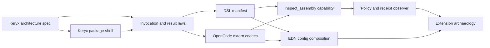

# yea I just wanna write opencode plugins and tools in clojurescript, typescript just feels so dirty now.

Yeah—use ClojureScript for the real implementation. The only unavoidable JavaScript/TypeScript surface is OpenCode’s *loader contract*: plugins must be JS/TS modules, and custom tools are discovered as JS/TS files; but those files can be tiny generated adapters that immediately delegate to your compiled CLJS bundle.[^2_1][^2_2]

For your “universal agent platform adapter” direction, I’d treat OpenCode as a target backend, not the language your business logic is written in.

## Recommended shape

```text
src/
  agent/
    core.cljs              ; pure event → command / decision logic
    contracts.cljs         ; Malli schemas, canonical IR
    opencode/
      plugin.cljs          ; plugin-specific hook adapters
      tools.cljs           ; tool handlers
      node.cljs            ; explicit JS boundary wrappers

.opencode/
  plugins/
    my-plugin.mjs          ; generated loader / entrypoint
  tools/
    research.mjs           ; generated tool definition / entrypoint

dist/
  opencode-plugin.mjs      ; shadow-cljs Node target output
```

Keep `agent.core` wholly ignorant of OpenCode, Bun, Node imports, and raw JS objects. It should accept normalized EDN data and return decisions/effects as data. Your `agent.opencode.*` namespaces decode OpenCode’s hook context and inputs at the boundary, call the core, then encode OpenCode’s expected result.

That reinforces the runtime boundary you have been moving toward: isolate Node interop in a narrow adapter rather than allowing JS shapes to permeate the system.

## Two practical paths

| Path | What OpenCode sees | What you write | Best use |
| :-- | :-- | :-- | :-- |
| **Compiled bundle directly** | A `.js` / `.mjs` output in `.opencode/plugins` or `.opencode/tools` | Almost entirely ClojureScript | Simple, local plugins and tools |
| **Thin JS shim** | A 5–15 line `.mjs` file that imports your compiled artifact | ClojureScript plus a disposable loader | Multiple generated plugins/tools, packaging, or a CLJS monorepo |

OpenCode loads local plugin files from `.opencode/plugins/` or `~/.config/opencode/plugins/`, and custom-tool definition files from `.opencode/tools/` or `~/.config/opencode/tools/`.  It also permits a custom tool’s implementation to invoke software written in any language, so the JS/TS-only rule is specifically the discovery/definition layer—not a mandate that your program logic be TypeScript.[^2_2][^2_1]

## Direct CLJS plugin

With `shadow-cljs`, target Node and export a function under the name OpenCode expects.

```clojure
;; src/agent/opencode/plugin.cljs
(ns agent.opencode.plugin
  (:require
   [clojure.string :as str]))

(defn- block-write?
  [{:keys [path]}]
  (str/ends-with? path ".env"))

(defn plugin
  [_ctx]
  #js
  {:tool.execute.before
   (fn [input _output]
     (let [tool-name (.-tool input)
           args      (js->clj (.-args input) :keywordize-keys true)]
       (when (and (= tool-name "write")
                  (block-write? args))
         (throw (js/Error. "Refusing to write secrets")))))})
```

```clojure
;; shadow-cljs.edn
{:source-paths ["src"]

 :builds
 {:opencode-plugin
  {:target :node-library
   :output-to ".opencode/plugins/agent-plugin.mjs"
   :exports {:default agent.opencode.plugin/plugin}
   :compiler-options {:output-feature-set :es2022}}}}
```

Conceptually, that generated `.mjs` is no different from an authored OpenCode plugin: OpenCode expects a module exporting a plugin function that receives a context and returns hooks.[^2_1]

The exact export map and generated module format may need a small adjustment based on your installed Shadow CLJS and whether OpenCode resolves a default versus named export—but that is a build-contract issue, not a reason to move the plugin into TS.

## Tool definitions: make the wrapper declarative

For custom tools, I would not allow every tool to become bespoke Node interop. Define your canonical tool contract in CLJS, then generate or compile the OpenCode-facing wrapper.

```clojure
(ns agent.contracts)

(def tool-registry
  {:research/search
   {:name        "research"
    :description "Search configured sources and return normalized findings."
    :input-schema [:map [:query :string]]
    :handler     'agent.tools.research/run}})
```

Your OpenCode adapter then does four boring things:

1. Converts the schema into the JSON-schema-like shape required by the OpenCode tool helper.
2. Converts incoming JS tool arguments into CLJS data.
3. Runs the handler, ideally with an explicit effect environment.
4. Converts the result into OpenCode’s tool-result shape.

OpenCode recommends the `tool()` helper for validation and type safety, and its filename becomes the tool name—meaning a generated `.mjs` wrapper per tool maps naturally to a registry-driven CLJS build.[^2_2]

## Where to tolerate JS

I would accept precisely these three bits of JavaScript:

- **Module loader/export semantics** if Shadow’s Node ESM output does not match OpenCode exactly.
- **A generated `package.json`** for dependencies that OpenCode expects to resolve through Bun.
- **Optional subprocess wrappers** where using an external utility is better than recreating it in CLJS.

Everything else—including hook routing, policy checks, tool descriptions, schemas, state machines, observability events, and agent orchestration—belongs in ClojureScript.

OpenCode installs package-based plugins with Bun and resolves local plugin/tool dependencies through a `package.json` in its config directory, so dependency resolution remains a real Node/Bun concern even if your source code is CLJS.[^2_1]

## Why this fits your DSL

Your canonical DSL can compile into a platform-neutral representation such as:

```clojure
{:id :policy/secret-write-guard
 :trigger {:kind :tool/before :tool :write}
 :when    [:path-suffix? ".env"]
 :effect  {:kind :reject
           :message "Refusing to write secrets"}}
```

Then the OpenCode backend emits a hook-map adapter; a Pi backend could emit its equivalent lifecycle registration; an MCP backend could instead expose a policy-aware tool. That gives you one semantic policy rather than three increasingly divergent implementations.

For OpenCode specifically, the adapter translates your `:tool/before` trigger to the corresponding plugin hook and preserves your core’s deterministic behavior. OpenCode plugins are explicitly event-hook extensions intended to add functionality, integrations, and behavior changes.[^2_1]

TypeScript feels dirty here because it is mostly *incidental host syntax*: dynamic object plumbing around a runtime contract. CLJS is a much better place to make the contracts, transformations, and policy logic legible.
<span style="display:none">[^2_10][^2_11][^2_12][^2_13][^2_14][^2_15][^2_3][^2_4][^2_5][^2_6][^2_7][^2_8][^2_9]</span>

<div align="center">⁂</div>

[^2_1]: https://opencode.ai/docs/plugins/

[^2_2]: https://opencode.ai/docs/custom-tools/

[^2_3]: https://opencode.ai/docs/it/plugins/

[^2_4]: https://dev.opencode.ai/docs/da/plugins/

[^2_5]: https://opencode.ai/docs/de/plugins/

[^2_6]: https://opencode.ai/docs/pl/plugins/

[^2_7]: https://opencode.ai/docs/bs/plugins/

[^2_8]: https://opencode.ai/docs/es/plugins/

[^2_9]: https://opencode.ai/docs/ko/plugins/

[^2_10]: https://opencode.ai/docs/ru/plugins/

[^2_11]: https://opencode.ai/docs/th/plugins/

[^2_12]: https://opencode.ai/docs/ja/plugins/

[^2_13]: https://opencode.ai/docs/zh-tw/plugins/

[^2_14]: https://opencode.ai/docs/ar/plugins/

[^2_15]: https://opencode.ai/docs/tr/plugins/


---

# I want some macros to make it look clean. like a `deftool` `defhook` `defplugin` or I can already see there bein one huge file where all the domains are registering their functions as tools. Either the macros, or some kinda vector based data oriented DSL like hiccup, so it composes.

Yes—make the DSL the authoring interface, and make OpenCode hook maps / `tool()` calls merely a compilation target. A registry that is data first, then rendered into runtime adapters, will compose better than a pile of `def`s with hidden global side effects.

OpenCode plugins ultimately return a hooks object, while plugin-defined tools are registered through the same plugin surface; standalone tool modules also allow multiple exports from one file.[^3_1][^3_2]

## Prefer data as the IR

Use a small declarative representation as the stable, inspectable intermediate representation. The important distinction is:

- `deftool`, `defhook`, and `defplugin` are **ergonomic constructors**.
- The resulting values are **plain data**.
- A single bootstrap namespace gathers those values and compiles them into an OpenCode plugin.
- Your OpenCode backend is only one interpreter of the registry.

```clojure
{:opencode/kind :tool
 :id            :research/search
 :name          "research_search"
 :description   "Search configured sources and return normalized findings."
 :args          [:map [:query :string] [:limit {:optional true} :int]]
 :handler       research/search}

{:opencode/kind :hook
 :id            :policy/protect-env
 :event         :tool.execute.before
 :priority      100
 :handler       policy/protect-env!}
```

Malli forms are especially appropriate for `:args`: they are data, can be inspected at load time, and give you one place to later derive OpenCode’s Zod schema, JSON Schema for MCP, documentation, tests, or a UI.

## Authoring macros

Use macros only to eliminate repetition and preserve source metadata. Avoid doing registration as macro-expansion side effect; it makes REPL reloads, dead-code elimination, dependency order, testing, and multi-runtime compilation unnecessarily weird.

```clojure
(ns agent.platform.dsl
  (:require-macros [agent.platform.dsl]))

(defmacro deftool
  [sym {:keys [id description args] :as options} argv & body]
  `(def ~sym
     (merge
      {:opencode/kind :tool
       :id            ~id
       :name          ~(or (:name options)
                           (clojure.core/name id))
       :description   ~description
       :args          ~args
       :handler       (fn ~argv ~@body)
       :source        ~(select-keys (meta &form) [:file :line :column])}
      ~(dissoc options :id :name :description :args))))

(defmacro defhook
  [sym {:keys [id event priority] :as options} argv & body]
  `(def ~sym
     (merge
      {:opencode/kind :hook
       :id            ~id
       :event         ~event
       :priority      ~(or priority 0)
       :handler       (fn ~argv ~@body)
       :source        ~(select-keys (meta &form) [:file :line :column])}
      ~(dissoc options :id :event :priority))))

(defmacro defplugin
  [sym & entries]
  `(def ~sym
     {:opencode/kind :plugin
      :id            ~(keyword (str *ns*) (name sym))
      :entries       [~@entries]}))
```

Then domain code stays small and reads like a declaration rather than a framework ceremony:

```clojure
(ns knoxx.tools.research
  (:require
   [agent.platform.dsl :refer-macros [deftool]]))

(deftool search
  {:id          :research/search
   :description "Search public sources and return normalized findings."
   :args        [:map
                 [:query :string]
                 [:limit {:optional true} :int]]}
  [{:keys [query limit]} _ctx]
  {:content (run-search query (or limit 10))})
```

```clojure
(ns knoxx.policy.secrets
  (:require
   [agent.platform.dsl :refer-macros [defhook]]))

(defhook deny-env-access
  {:id       :policy/deny-env-access
   :event    :tool.execute.before
   :priority 100}
  [{:keys [tool args]} _ctx]
  (when (and (#{"read" "write"} tool)
             (env-file? (:path args)))
    {:opencode/action :reject
     :message "Access to environment files is blocked"}))
```

The hook event vocabulary should track OpenCode’s supported lifecycle events, including `:tool.execute.before`, `:tool.execute.after`, session events, file events, permission events, and command events.[^3_1]

## Hiccup-style composition

You can also make plugin construction entirely vector based. I’d support this **in addition to** the macros, because it is valuable for generated registrations and domain configuration.

```clojure
(def research-plugin
  [:plugin {:id :plugin/research}

   [:tool {:id          :research/search
           :description "Search public sources."
           :args        [:map [:query :string]]}
    research/search]

   [:hook {:id       :policy/protect-env
           :event    :tool.execute.before
           :priority 100}
    policy/protect-env!]])
```

A normalizer converts the syntax tree into the canonical registry values:

```clojure
(defn normalize
  [[tag attrs & children :as form]]
  (case tag
    :plugin
    {:opencode/kind :plugin
     :id            (:id attrs)
     :entries       (mapv normalize children)}

    :tool
    (let [[handler] children]
      (assoc attrs
             :opencode/kind :tool
             :name (or (:name attrs)
                       (name (:id attrs)))
             :handler handler))

    :hook
    (let [[handler] children]
      (assoc attrs
             :opencode/kind :hook
             :priority (or (:priority attrs) 0)
             :handler handler))

    (throw (ex-info "Unknown agent DSL node"
                    {:form form :tag tag}))))
```

That lets a domain own a vector, while the top-level application just concatenates plugins:

```clojure
(def app
  [:plugin {:id :plugin/knoxx}
   research-plugin
   browser-plugin
   discord-plugin
   policy-plugin])
```

This does **not** become one huge file. Each vertical slice exports either:

- One `defplugin` value, such as `knoxx.tools.browser/plugin`, or
- A Hiccup-like vector, such as `knoxx.tools.browser/spec`.

Then the application composition root is intentionally boring:

```clojure
(ns knoxx.opencode.app
  (:require
   [knoxx.tools.research :as research]
   [knoxx.tools.browser :as browser]
   [knoxx.policy.secrets :as secrets]
   [agent.platform.dsl :as dsl]))

(def plugin-spec
  [:plugin {:id :plugin/knoxx}
   research/plugin
   browser/plugin
   secrets/plugin])

(def registry
  (dsl/normalize plugin-spec))
```

That is a desirable “one place that says what exists,” rather than a bad “one place where every implementation lives.”

## Compile the registry

Make one pure compiler from registry data to the OpenCode shape:

```clojure
(defn compile-plugin
  [registry ctx]
  (let [entries (tree-seq #(= :plugin (:opencode/kind %))
                          :entries
                          registry)
        tools   (filter #(= :tool (:opencode/kind %)) entries)
        hooks   (filter #(= :hook (:opencode/kind %)) entries)]
    (merge
     (compile-tools tools ctx)
     (compile-hooks hooks ctx))))
```

The subtle design choice: **many internal hooks may target one OpenCode event**. Your compiler groups them by `:event`, sorts by `:priority`, and builds exactly one OpenCode callback per event. OpenCode itself wants a hooks object keyed by event name, so grouping belongs in the adapter rather than leaking into domain code.[^3_1]

```clojure
(defn compose-hooks
  [hooks]
  (into {}
        (for [[event definitions] (group-by :event hooks)]
          [event
           (fn [input output]
             (reduce
              (fn [_ definition]
                ((:handler definition)
                 (js->clj input :keywordize-keys true)
                 {:output output}))
              nil
              (sort-by :priority > definitions)))])))
```

For failures, I would not make every hook throw directly. Make handlers return an explicit result algebra:

```clojure
{:effect :continue}
{:effect :reject :message "Blocked by secret-file policy"}
{:effect :patch :output {:path "safe-replacement"}}
{:effect :log :level :warn :message "Untrusted input"}
```

Then the OpenCode renderer decides whether `:reject` becomes an exception, whether `:patch` mutates the output object, and whether logs go to OpenCode’s structured client logger. OpenCode documents `client.app.log()` as its structured logging route, rather than `console.log`.[^3_1]

## Do not expose host shapes

Your tool function should never receive the raw OpenCode context. Instead:

```clojure
{:session/id       "..."
 :workspace/root   "/repo"
 :worktree/root    "/repo"
 :cwd              "/repo"
 :capabilities     #{:filesystem/read :network/search}}
```

OpenCode supplies per-session directory and worktree context to custom tools, so the compiler can normalize those values once at the boundary.  This preserves your ability to render the identical tool definition toward MCP, Pi, Codex hooks, or a standalone CLI without letting a host runtime dictate the core API.[^3_2]

## Suggested final vocabulary

I’d begin narrowly:

```clojure
(deftool name options [input ctx] ...)
(defhook name options [event ctx] ...)
(defplugin name entries...)
(plugin [& entries])
(tool opts handler)
(hook opts handler)
```

Then use these data combinators heavily:

```clojure
(only-in #{:dev} plugin)
(requires #{:network/search} tool)
(with-policy policy tool)
(with-timeout 10000 tool)
(named "browser_inspect" tool)
(disabled-when predicate tool)
```

The macros provide pleasant source-level definitions; the constructors and combinators allow configuration, generation, testing, and cross-platform compilation. That gives you the Hiccup composability you want without locking the whole agent system into macro magic.

<div align="center">⁂</div>

[^3_1]: https://opencode.ai/docs/plugins/

[^3_2]: https://opencode.ai/docs/custom-tools/


---

# you know, it'd be nice to have an `opencode.edn` or something, which I could break down into chunks, instead of the monolith we get by default per project.

Exactly. An `opencode.edn` should be **your project’s composable source configuration**, while OpenCode receives generated `opencode.json`, plugin modules, and tool modules. OpenCode currently consumes JSON/JSONC configuration plus JS/TS plugin and tool modules, so EDN would be a project-side authoring layer rather than something OpenCode reads natively.[^4_1][^4_2]

## Make EDN the source

```text
project/
  opencode.edn                 ; tiny composition root
  opencode/
    policy.edn
    research.edn
    browser.edn
    git.edn
    agents.edn
  src/
    knoxx/opencode/
      compiler.cljs
      runtime.cljs
      tool_registry.cljs
  .opencode/
    opencode.json              ; generated, gitignored or committed
    plugins/
      knoxx.mjs                ; generated Shadow output
    tools/
      knoxx.mjs                ; generated Shadow output
```

`opencode.edn` should contain only project identity, imports, environment selection, and high-level composition:

```clojure
{:opencode/version 1
 :project/id        :knoxx

 :imports
 ["opencode/policy.edn"
  "opencode/research.edn"
  "opencode/browser.edn"
  "opencode/git.edn"
  "opencode/agents.edn"]

 :profiles
 {:dev  {:enable #{:research/search
                   :browser/inspect
                   :git/status}}
  :ci   {:enable #{:git/status}
         :deny   #{:network/* :browser/*}}
  :prod {:enable #{:research/* :browser/* :git/*}}}}
```

The split files export **data fragments**, not operational code.

## Domain fragments

`opencode/research.edn`:

```clojure
{:tools
 [{:id          :research/search
   :impl        knoxx.tools.research/search
   :name        "research_search"
   :description "Search configured public sources."
   :args        [:map
                 [:query :string]
                 [:limit {:optional true} [:int {:min 1 :max 50}]]]
   :requires    #{:network/search}
   :tags        #{:research :network}}]

 :hooks
 [{:id       :research/audit-results
   :event    :tool.execute.after
   :impl     knoxx.policy.audit/tool-result!
   :priority 10}]}
```

`opencode/policy.edn`:

```clojure
{:hooks
 [{:id       :policy/protect-secrets
   :event    :tool.execute.before
   :impl     knoxx.policy.secrets/check!
   :priority 100
   :applies-to #{:read :write :edit :bash}}

  {:id       :policy/audit-execution
   :event    :tool.execute.after
   :impl     knoxx.policy.audit/record!
   :priority -100}]}
```

The `:impl` value is deliberately a qualified symbol, not a serialized function. EDN names a capability implementation; your CLJS compiler resolves it from a deliberately exported handler table.

## Avoid arbitrary eval

Do **not** read EDN and dynamically `resolve` arbitrary symbols from the disk. Treat the EDN as an untrusted-ish declarative input and resolve only against a registry you compile into the application.

```clojure
(ns knoxx.opencode.handlers
  (:require
   [knoxx.tools.research :as research]
   [knoxx.policy.secrets :as secrets]
   [knoxx.policy.audit :as audit]))

(def handlers
  {'knoxx.tools.research/search      research/search
   'knoxx.policy.secrets/check!      secrets/check!
   'knoxx.policy.audit/record!       audit/record!
   'knoxx.policy.audit/tool-result!  audit/tool-result!})
```

```clojure
(defn link-impl
  [handlers {:keys [id impl] :as definition}]
  (if-let [handler (get handlers impl)]
    (assoc definition :handler handler)
    (throw (ex-info "Unknown OpenCode implementation"
                    {:definition id
                     :implementation impl
                     :known (sort (keys handlers))}))))
```

That gets you an explicit link step: invalid tool IDs, missing implementations, duplicate names, invalid Malli schemas, cyclic imports, and illegal profile rules fail at build time rather than halfway through an agent session.

## Imports and merge rules

EDN cannot directly express an `:include` directive without an interpreter, which is good: you get to specify merge semantics instead of adopting accidental behavior.

I would make import order explicit and merge collections by concatenation:

```clojure
(defn merge-fragments
  [& fragments]
  (->> fragments
       (reduce
        (fn [out fragment]
          (-> out
              (update :tools into (:tools fragment))
              (update :hooks into (:hooks fragment))
              (update :agents into (:agents fragment))
              (update :mcp into (:mcp fragment))))
        {:tools [] :hooks [] :agents [] :mcp []})))
```

Then validate uniqueness *after* merge:

```clojure
(defn duplicate-ids
  [definitions]
  (->> definitions
       (map :id)
       frequencies
       (keep (fn [[id n]] (when (< 1 n) id)))
       sort))

(defn validate-registry!
  [{:keys [tools hooks] :as registry}]
  (let [duplicates (concat (duplicate-ids tools)
                           (duplicate-ids hooks))]
    (when (seq duplicates)
      (throw (ex-info "Duplicate OpenCode IDs"
                      {:duplicates (vec duplicates)})))
    registry))
```

This gives you a deterministic “last writer does **not** win” policy. For tools and policies, collisions should almost always be a compile error.

## Profiles are data transforms

Profiles should transform a fully merged registry before compilation:

```clojure
(defn selected?
  [{:keys [enable deny]} {:keys [id tags]}]
  (and
   (or (empty? enable)
       (some #(or (= id %)
                  (and (keyword? %)
                       (= "*" (name %))
                       (= (namespace id) (namespace %))))
             enable))
   (not (some #(or (= id %)
                   (and (= "*" (name %))
                        (= (namespace id) (namespace %))))
              deny))))

(defn apply-profile
  [profile registry]
  (update registry :tools
          #(filterv (partial selected? profile) %)))
```

You could select a profile with `OPENCODE_PROFILE=dev` in the Shadow build or a small CLJS build command. The output for a profile is deterministic and can be snapshot-tested:

```text
opencode.edn + fragments + profile
  -> normalized registry EDN
  -> validated linked registry
  -> OpenCode plugin/tool adapters + opencode.json
```

OpenCode’s own configuration applies global and project configuration and then loads global and project-local plugin sources in a defined order, so generating a project-local `.opencode/` directory fits its native loading model.[^4_2]

## Generated output

Your generator can emit:

```json
{
  "$schema": "https://opencode.ai/config.json",
  "plugin": ["file://./plugins/knoxx.mjs"],
  "permission": {
    "browser_*": "allow",
    "research_*": "allow"
  }
}
```

And Shadow emits the plugin module that registers all enabled tools and composes the enabled hooks. The generated OpenCode config is intentionally dumb: it only describes host-facing settings and points at compiled code.

OpenCode supports project-specific configuration through `opencode.json` and `.opencode` directories, and project-local plugins are automatically loaded from `.opencode/plugins/`.[^4_1][^4_2]

## Use both macro and EDN layers

They solve different problems:


| Layer | Purpose | Best content |
| :-- | :-- | :-- |
| `deftool` / `defhook` | Defines executable CLJS behavior | Handler code, schemas, local defaults |
| `opencode/*.edn` | Declares a project’s enabled capabilities | Tool selection, names, descriptions, policy ordering, profiles |
| `opencode.edn` | Composes the project | Fragment imports and profiles |
| Compiler | Resolves and validates | Linking, collision detection, output generation |
| `.opencode/` | OpenCode-compatible artifact | Generated config and JS modules |

The architecture lets a domain say “I implement `research/search`,” while each project says whether it wants that capability, under what name, and under which policies. That is vastly cleaner than copying TypeScript files or growing an enormous default config.

## One adjustment

I would call the source file `opencode.edn`, but keep fragment files in an unmistakably separate directory such as `.opencode-src/`:

```text
opencode.edn
.opencode-src/
  browser.edn
  research.edn
  policies.edn
.opencode/
  opencode.json
  plugins/knoxx.mjs
```

That prevents people—and your own tooling—from confusing the input DSL with OpenCode’s actual `.opencode/` discovery directory. OpenCode’s documented local dependency mechanism also uses `.opencode/package.json`, which is another reason to reserve that directory for generated/runtime-facing material.[^4_2]
<span style="display:none">[^4_10][^4_11][^4_12][^4_13][^4_14][^4_15][^4_3][^4_4][^4_5][^4_6][^4_7][^4_8][^4_9]</span>

<div align="center">⁂</div>

[^4_1]: https://opencode.ai/docs/config/

[^4_2]: https://opencode.ai/docs/plugins/

[^4_3]: https://opencode.ai/docs/pt-br/config/

[^4_4]: https://dev.opencode.ai/docs/fr/config/

[^4_5]: https://opencode.ai/docs/de/config/

[^4_6]: https://opencode.ai/docs/it/config/

[^4_7]: https://opencode.ai/docs/pl/config/

[^4_8]: https://opencode.ai/docs/nb/config/

[^4_9]: https://opencode.ai/docs/de/plugins/

[^4_10]: https://opencode.ai/docs/ja/config/

[^4_11]: https://opencode.ai/docs/bs/config/

[^4_12]: https://dev.opencode.ai/docs/ko/config/

[^4_13]: https://opencode.ai/docs/troubleshooting/

[^4_14]: https://opencode.ai/docs/ru/config/

[^4_15]: https://opencode.ai/docs/tools/


---

# Probably best we group it with the rest of our edn data, in our `.ημ/` folder. in like `.ημ/config/opencode/*.edn`

Yes—that is the right home. `.ημ/` is already your project’s semantic/data layer, so OpenCode configuration should be another projection of that data, not a special mini-ecosystem living beside it. Your contract DSL is explicitly EDN-first and intended to be interpreted into runtime behavior, which makes OpenCode an especially natural target.

```text
project/
  .ημ/
    config/
      opencode/
        root.edn              ; composition root
        profiles.edn          ; dev, ci, local, restricted
        plugins/
          core.edn
          policy.edn
          research.edn
          browser.edn
          git.edn
          discord.edn
        agents/
          research.edn
          review.edn
        permissions/
          default.edn
          ci.edn

    contracts/
      tool.edn
      hook.edn
      plugin.edn
      opencode.edn

    ledgers/
      agent/
      policy/
      tool-invocations/

  src/
    ημ/
      opencode/
        read_config.cljs
        link.cljs
        validate.cljs
        compile.cljs
        emit.cljs
      opencode/
        handlers.cljs

  .opencode/
    opencode.json             ; generated host artifact
    package.json              ; host dependency resolution
    plugins/
      eta-mu.mjs              ; compiled CLJS module
```

OpenCode itself still expects JSON configuration and locally discovered JS/TS modules, so `.ημ/config/opencode/` is the editable source tree while `.opencode/` is a disposable generated runtime boundary.[^5_1][^5_2]

## Composition root

I would call the top-level file `.ημ/config/opencode/root.edn`, rather than `opencode.edn` at repository root:

```clojure
{:ημ/opencode-version 1
 :id                  :knoxx/opencode

 :imports
 ["profiles.edn"
  "permissions/default.edn"

  "plugins/core.edn"
  "plugins/policy.edn"
  "plugins/research.edn"
  "plugins/browser.edn"
  "plugins/git.edn"

  "agents/research.edn"
  "agents/review.edn"]

 :profile :dev}
```

This makes the path itself communicate the hierarchy:

```text
.ημ/config/opencode/
  └── configuration data for the OpenCode target
```

And later:

```text
.ημ/config/pi/
.ημ/config/codex/
.ημ/config/mcp/
.ημ/config/browser/
```

Each target is a projection over the same contracts, capabilities, policies, and domain implementations—not a separate version of your system.

## Separate semantics from target wiring

There are three kinds of data here, and I would keep them distinct.


| Location | Meaning | Reusable outside OpenCode? |
| :-- | :-- | :-- |
| `.ημ/contracts/` | Laws, schemas, capability definitions | Yes |
| `.ημ/config/opencode/` | OpenCode composition, mappings, profile choices | Partly |
| `src/ημ/opencode/` | CLJS runtime adapter and host interop | No |
| `.opencode/` | Generated OpenCode-compatible output | No |

For example, the generic capability should not be named `:opencode/tool`. It should be a system-level thing:

```clojure
;; .ημ/contracts/capabilities/research.edn
{:id          :capability/research-search
 :input       [:map
               [:query :string]
               [:limit {:optional true} :int]]
 :output      [:map
               [:findings [:vector :map]]]
 :effects     #{:network/search}
 :handler     ημ.domain.research/search}
```

Then the OpenCode config decides how that capability is exposed:

```clojure
;; .ημ/config/opencode/plugins/research.edn
{:tools
 [{:id          :opencode/research-search
   :capability  :capability/research-search
   :name        "research_search"
   :description "Search configured public sources."
   :tags        #{:research :network}}]}
```

That prevents the host from colonizing the core model. MCP can expose `:capability/research-search` under another name; Pi can bind it to a different plugin mechanism; the CLI can expose it as `ημ research search`.

## Config is a projection

The flow should be:

```text
.ημ/contracts/*.edn
        +
.ημ/config/opencode/**/*.edn
        +
CLJS handler registry
        |
        v
validated OpenCode registry
        |
        +--> .opencode/opencode.json
        +--> .opencode/plugins/eta-mu.mjs
        +--> generated tool metadata / documentation
        +--> `.ημ/ledgers/agent/...` audit events at runtime
```

The configuration linker resolves a capability ID to an approved compiled handler, verifies its input/output contract, applies the active profile, and only then emits OpenCode-facing code. This lines up with your existing emphasis on explicit boundaries between CLJS logic and Node runtime representations.

## Profiles belong nearby

Profiles should live next to OpenCode config because profiles describe **how that host is allowed to expose capabilities**, not the universal semantics of a capability.

```clojure
;; .ημ/config/opencode/profiles.edn
{:profiles
 {:dev
  {:allow #{:capability/research-search
            :capability/browser-inspect
            :capability/git-status}
   :audit :verbose}

  :ci
  {:allow #{:capability/git-status}
   :deny-effects #{:network/search :browser/control}
   :audit :strict}

  :personal
  {:allow #{:capability/*}
   :audit :full}}}
```

That permits a project to run the exact same capability implementation with radically different operational authority. The compiler should reject a config that enables a tool whose declared effects are disallowed by its profile.

## Keep generated artifacts boring

```gitignore
# Generated OpenCode target artifacts
.opencode/opencode.json
.opencode/plugins/eta-mu.mjs
.opencode/tools/eta-mu.mjs
```

I would normally **commit** `.opencode/package.json` and a lockfile if those host dependencies are intentional, but generate its dependency list from your source configuration if you want one canonical declaration. OpenCode supports local plugins and tools with external npm dependencies placed in `.opencode/package.json`.[^5_2]

A generated `opencode.json` should only contain host concerns—plugin paths, named external plugins, direct OpenCode permissions, and defaults OpenCode itself needs. OpenCode’s documented configuration format is JSON, with project-specific configuration and `.opencode` directories as its project-local extension boundary.[^5_1][^5_2]

## Naming suggestion

Use `ημ` as the semantic namespace and reserve `opencode` as an adapter name:

```clojure
:ημ/kind       :capability
:ημ/id         :research/search
:ημ/contracts  {:input :contract/research-query
                :output :contract/research-findings}

:opencode/name "research_search"
:opencode/hook :tool.execute.before
```

Or, more strictly, avoid embedding `:opencode/*` fields in universal objects at all and keep such mappings only under `.ημ/config/opencode/`.

That leaves you with a legible topology:

- **ημ says what exists and what is lawful.**
- **OpenCode config says what this project exposes through OpenCode.**
- **The CLJS compiler links the two and enforces the boundary.**
- **`.opencode/` is generated compatibility output, not where the design lives.**

<div align="center">⁂</div>

[^5_1]: https://opencode.ai/docs/config/

[^5_2]: https://opencode.ai/docs/plugins/


---

# is it possible to emit typescript type declaration files from typedclosure annotations?

**Yes, but probably not as a built-in one-step feature.** If TypedClosure annotations preserve enough type information in macro metadata or a compiler-visible registry, you can emit `.d.ts` files directly from that representation; TypeScript declaration files are simply the external module API contract.[^6_1][^6_9]

The good version is **not**:

```text
CLJS → emitted JS with Closure JSDoc → parse JSDoc → .d.ts
```

It is:

```text
TypedClosure annotations
        ↓
canonical ημ type / contract IR
        ├── Closure annotations or runtime validators
        ├── Malli schema / JSON Schema
        ├── OpenCode tool schema
        └── TypeScript .d.ts
```

That makes TypeScript declarations another target of the same contract system—not an inference pass over generated JavaScript.

## The feasibility boundary

It depends on what “TypedClosure annotations” means mechanically:


| Annotation form | Can emit `.d.ts`? | Recommended approach |
| :-- | --: | :-- |
| Macro arguments / EDN type forms | Yes, strongly | Generate from macro input at compile time |
| Var metadata attached by a macro | Yes | Collect public API metadata into a registry |
| TypedClosure’s internal type AST | Yes | Implement a direct type-AST to TypeScript-AST renderer |
| Closure-style JSDoc in emitted JS | Mostly | Parse JSDoc, but expect edge cases |
| Only Closure Compiler’s post-analysis knowledge | Not cleanly | Do not rely on this as the source of declarations |

A prior tool, `closure-ts`, demonstrates that Closure JSDoc annotations can be translated into `.d.ts` files.  But it is an old and narrow path; for ημ, a direct emitter from your own typed contract representation will be more reliable and much more useful.[^6_3]

## The type translation is mostly manageable

The common portion maps cleanly:

```clojure
[:string]                   ; string
[:int]                      ; number
[:boolean]                  ; boolean
[:nil]                      ; null | undefined, by policy
[:vector :string]           ; string[]
[:set :keyword]             ; Set<string>
[:map [:id :uuid]]          ; { id: string }
[:or :string :int]          ; string | number
[:maybe :string]            ; string | null
[:tuple :string :int]       ; [string, number]
```

For a tool:

```clojure
(defopencode-tool research-search
  {:input  [:map
            [:query :string]
            [:limit {:optional true} [:int {:min 1 :max 100}]]]
   :output [:map
            [:findings [:vector :research/finding]]
            [:source-count :int]]}
  [ctx {:keys [query limit]}]
  ...)
```

You could emit:

```ts
export interface ResearchSearchInput {
  query: string;
  limit?: number;
}

export interface ResearchFinding {
  title: string;
  url: string;
  summary?: string;
}

export interface ResearchSearchOutput {
  findings: ResearchFinding[];
  sourceCount: number;
}

export declare function researchSearch(
  input: ResearchSearchInput,
  context: ToolContext
): Promise<ResearchSearchOutput>;
```

And then package it conventionally:

```text
dist/
  opencode-plugin.mjs
  opencode-plugin.d.ts
package.json
```

```json
{
  "exports": {
    ".": {
      "types": "./dist/opencode-plugin.d.ts",
      "default": "./dist/opencode-plugin.mjs"
    }
  }
}
```

TypeScript tooling understands `.d.ts` as a package’s API description and will use bundled declarations when it resolves the package.[^6_9]

## Make it an ημ target

I would add an emitter namespace rather than bake TypeScript concerns into `defcontract` or `deftool`:

```text
src/ημ/
  type/
    ir.cljc
    normalize.cljc
  emit/
    closure.cljs
    malli.cljs
    json_schema.cljs
    typescript.cljs
    opencode.cljs
```

Then give each public definition a normalized, serializable descriptor:

```clojure
{:ημ/kind       :tool
 :ημ/id         :research/search
 :ημ/export?    true
 :ημ/params
 [{:name :input
   :type [:ref :contract/research-search-input]}]
 :ημ/returns    [:promise [:ref :contract/research-search-output]]
 :ημ/effects    #{:network/search}
 :ημ/docs       {:summary "Search configured public sources."}}
```

The TypeScript emitter only handles public exported entries:

```clojure
(defn emit-module
  [{:keys [types exports]}]
  (str
   (emit-type-declarations types)
   "\n"
   (emit-export-declarations exports)))
```

This lets the same definitions emit:

- `.d.ts` for TypeScript consumers.
- JSON Schema for OpenCode/MCP boundaries.
- Malli validators for your ClojureScript runtime.
- Docs, tool manifests, and generated test cases.
- Closure-compatible annotations, if that remains useful internally.


## Use a closed shared vocabulary

The difficult part is not writing a TypeScript printer. It is preventing semantic drift between the type systems.

Closure’s types and TypeScript’s types overlap substantially, but they do not mean exactly the same thing:

- **TypeScript is structurally typed**; object compatibility is based mostly on shape.
- **Closure types** can carry more nominal conventions through constructors, interfaces, and namespaces.
- **ClojureScript maps** may be persistent maps, JS objects, records, or tagged data—those are not automatically interchangeable at a JS boundary.
- **`nil`, `null`, and `undefined`** must have an explicit policy.
- **Keywords, UUIDs, instants, EDN values, and tagged unions** need deliberate wire representations.
- Runtime validation must remain authoritative; `.d.ts` improves authoring and editor feedback but cannot enforce untyped JS callers.

For your architecture, I would make wire types part of the contract:

```clojure
{:ημ/type :uuid
 :wire/type :string
 :wire/format :uuid}

{:ημ/type :keyword
 :wire/type :string
 :wire/pattern "^[^/]+/.+$"}

{:ημ/type :instant
 :wire/type :string
 :wire/format :date-time}
```

Then `emit-typescript` never needs to guess whether an internal `UUID` is a string, a JS `Date`, or a custom runtime value.

## A macro design that supports emission

Your defining macro can register a descriptor at macro-expansion time, while still compiling an ordinary CLJS function:

```clojure
(defcontract research-search-input
  [:map
   [:query :string]
   [:limit {:optional true} [:int {:min 1 :max 100}]]])

(deftool research-search
  {:input  :contract/research-search-input
   :output :contract/research-search-output
   :export :typescript}
  [ctx input]
  ...)
```

The macro should produce two things conceptually:

1. The ordinary executable var/function.
2. A pure descriptor added to a compile-time manifest.
```clojure
{:ημ/id       :research/search
 :ημ/kind     :tool
 :ημ/var      'ημ.tools.research/search
 :ημ/input    :contract/research-search-input
 :ημ/output   :contract/research-search-output
 :emit        #{:opencode :typescript :json-schema}}
```

Your build task can collect the manifest and write:

```text
target/ημ/api-manifest.edn
dist/ημ-opencode.d.ts
dist/ημ-opencode.schema.json
.opencode/opencode.json
```

That is better than relying on names or reflection after advanced compilation, where useful source-level identities may be renamed or eliminated.

## What I would not do

Avoid treating TypeScript declarations as the universal type language. TypeScript should be a **consumer projection**, just like OpenCode plugin output.

Also avoid generating declarations from arbitrary implementation inference. A function body cannot reliably describe effects, serializable shape, error behavior, or operational authority. Your contracts already carry the information that matters.

And avoid exposing every internal CLJS var. Emit declarations only for deliberately public, JS-safe boundaries:

```clojure
{:ημ/export
 {:typescript {:module "@open-hax/eta-mu-opencode"
               :name   "researchSearch"}
  :opencode   {:name "research_search"}
  :mcp        {:name "research.search"}}}
```


## Best first milestone

Start with a deliberately boring subset:

1. Named scalar types: string, boolean, number, integer, keyword-as-string, UUID-as-string.
2. Maps with required and optional keys.
3. Vectors, tuples, enums, unions, and references.
4. Async tool functions as `Promise<T>`.
5. Tagged result/error unions.
6. Snapshot tests comparing emitted `.d.ts` against checked-in golden files.
7. A tiny TypeScript consumer fixture compiled with `tsc --noEmit`.

TypeScript’s own compiler can emit declarations for TS/JS sources when `declaration` is enabled, but in your case you are not deriving contracts from TypeScript—you are generating the declaration source artifact directly from ημ’s contracts.[^6_1]

So: **absolutely possible, and it is a very good fit for ημ.** TypedClosure annotations can be one input, but the durable move is to normalize them into your own contract IR and emit `.d.ts` as a first-class backend.
<span style="display:none">[^6_10][^6_2][^6_4][^6_5][^6_6][^6_7][^6_8]</span>

<div align="center">⁂</div>

[^6_1]: https://www.typescriptlang.org/tsconfig/declaration.html

[^6_2]: https://github.com/material-components/material-components-web/issues/134

[^6_3]: https://github.com/teppeis/closure-ts

[^6_4]: https://stackoverflow.com/questions/76369054/typescript-emitted-type-declaration-files-not-including-undefined-as-a-type

[^6_5]: https://dev.to/jsmanifest/typescript-60-isolateddeclarations-what-it-actually-replaces-and-why-it-matters-716

[^6_6]: https://www.npmjs.com/package/tsickle

[^6_7]: https://medium.com/@martin_hotell/typescript-library-tips-rollup-your-types-995153cc81c7

[^6_8]: https://github.com/artifacthealth/tsreflect-compiler

[^6_9]: https://www.typescriptlang.org/docs/handbook/2/type-declarations.html

[^6_10]: https://adropincalm.com/blog/notes-on-making-typescript-declaration-files/


---

# you bring up a problem we have to address early on, in js/clj data type interop can get messy if you don't establish those boundries early, and enforce them cleanly.

I'd like for the macros to consume cljs data types, and handle where the translations need to happen, so I can operate with out thinking about the issue.

I really... don't know the long term real solution to this, at least when dealing with agents. They will just do the conversions and add annotations everywhere until they get confused enough they can't reason about it any more.

I was working with something like a `boundries.js` `boundries.node.*` `boundries.library-name` kind of scheme,

What do you think? I would like for `domain.*` and `infra.*` to never have any js types, but.... promises can kinda make that odd, fastify made it kinda wierd, it's high order functions handed us js types, and expected js types.

I didn't design a DSL for that until most my rest api was already written the last time, I think wrapping those sorts of frameworky things in macros to make them make sense in clojure is the way to go.

Yes. I think this has to be an architectural law, not an aspiration:

> **Domain and infrastructure operate on ημ values. Boundary namespaces alone may see JavaScript values, promises, callbacks, or host objects.**

That is the long-term solution to agents spraying `js->clj`, `clj->js`, `#js`, `aget`, and type annotations across the codebase: make those operations structurally illegal outside a narrow anti-corruption layer, then give people—and agents—a pleasant DSL so they never need to reach for raw interop.

ClojureScript can directly consume Promise APIs and its current compiler can emit native JavaScript `async` functions from `^:async` definitions, so there is no need to contaminate the domain just because Node libraries happen to be asynchronous.[^7_1][^7_2]

## The boundary law

I would draw the line slightly differently than “no JS in `domain.*` and `infra.*`.”


| Namespace family | JS values allowed? | Promise allowed? | Responsibility |
| :-- | --: | --: | :-- |
| `shape.*`, `law.*`, `domain.*` | Never | Never | Pure contracts, transformations, decisions |
| `application.*` | Never | Prefer no | Use-case orchestration, effect descriptions |
| `infra.*` | Never directly | Never directly | Port implementations expressed in ημ data |
| `boundaries.*` | Yes | Yes | Node/npm/framework translation |
| `runtime.*` | Yes | Yes | Process startup, adapter composition, lifecycle |
| Generated OpenCode adapter | Yes | Yes | Host-specific glue only |

The key correction is that `infra.*` should mean **infrastructure semantics**, not “whatever framework code touches the network.” A Fastify implementation is a Node boundary adapter; a persistent repository port that accepts and returns ημ values is `infra.*`.

So this:

```text
domain → application → infra → boundaries.node.fastify → Fastify
```

is preferable to this:

```text
domain → infra.fastify → Fastify
```

Your existing instinct to put explicit Node wrappers around libraries and enforce a CLJS/JS separation is exactly the right basis.

## Name boundaries by vendor

Your proposed naming scheme is good, with one refinement: use `boundaries` as a **plural package**, and name namespaces by the external vocabulary they isolate.

```text
src/
  ημ/
    shape/
    law/
    domain/
    application/
    infra/

    boundaries/
      js.cljs                 ; minimal primitive conversions
      node/
        fs.cljs
        path.cljs
        process.cljs
        streams.cljs
      fastify.cljs
      opencode.cljs
      npm/
        zod.cljs
        pino.cljs
      library/
        playwright.cljs
        discord_js.cljs

    runtime/
      server.cljs
      opencode_plugin.cljs
```

I would avoid a generic `boundaries.library-name` flat namespace once the codebase grows. Group by host/runtime first where it gives useful policy (`node/*`, `browser/*`), then by individual library.

```clojure
(ημ.boundaries.fastify/listen! app {:port 3000})
(ημ.boundaries.node.fs/read-text! path)
(ημ.boundaries.opencode/register-plugin! registry)
```

The important part is that **no one imports npm directly outside `ημ.boundaries.*`**. Shadow CLJS can import npm modules normally, but the ability to import them should not become permission for every domain namespace to depend on their object models.[^7_3][^7_4]

## Do not use raw `js->clj`

A global unconstrained `js->clj` is a leaky and ambiguous conversion. It does not know whether a JavaScript object represents:

- A request body to decode.
- An opaque Fastify request.
- A Node stream.
- A callback-bearing capability.
- An `Error`.
- An array that should become a vector.
- An object whose prototype and methods must be retained.

Instead, encode and decode named **wire contracts** at each boundary.

```clojure
(ns ημ.boundaries.fastify
  (:require
   [malli.core :as m]
   [ημ.wire.http :as http]
   ["fastify" :as Fastify]))

(defn decode-request
  [request]
  {:http/method  (keyword (.-method request))
   :http/path    (.-url request)
   :http/headers (js->clj (.-headers request))
   :http/params  (js->clj (.-params request) :keywordize-keys true)
   :http/query   (js->clj (.-query request) :keywordize-keys true)
   :http/body    (js->clj (.-body request) :keywordize-keys true)})

(defn encode-response
  [{:http/keys [status headers body]}]
  {:status  (or status 200)
   :headers (or headers {})
   :body    (clj->js body)})
```

Then only the boundary has permission to touch raw Fastify request/reply objects. The rest sees:

```clojure
{:http/method :post
 :http/path "/contracts"
 :http/headers {"content-type" "application/json"}
 :http/params {}
 :http/query {}
 :http/body {:contract/id :agent/research}}
```

Validate at that point—before the object gets any deeper:

```clojure
(defn decode-request!
  [request]
  (let [value (decode-request request)]
    (if (m/validate http/request value)
      value
      (throw (ex-info "Invalid inbound HTTP request"
                      {:boundary :fastify
                       :explain  (m/explain http/request value)})))))
```

That is the difference between “we convert JS to Clojure” and “we enforce an ingress contract.”

## Promise is not domain data

You are right that Promises make this feel weird. The rule is simple:

> A Promise is a transport implementation detail, not a domain value.

A boundary function may return a JS Promise because Fastify/OpenCode/Node demand it. But immediately after the await point, restore ημ data.

ClojureScript now supports native `await` inside `^:async` functions, which lets an adapter look direct and ordinary without spreading `.then` chains across your system.  If you use `core.async`, `<p!` can consume a JS Promise inside a `go` block, but that changes the API to a channel; do that only if channels are actually your internal concurrency model.[^7_2][^7_1]

```clojure
(ns ημ.boundaries.node.fs
  (:require
   ["node:fs/promises" :as fs]
   [ημ.boundaries.js :as jsb]))

(defn ^:async read-text!
  [path]
  (try
    (await (.readFile fs path "utf8"))
    (catch :default cause
      (throw (ex-info "Unable to read file"
                      {:boundary :node.fs
                       :path path}
                      cause)))))
```

The boundary returns `Promise<string>` to satisfy its host integration. An application adapter may await it and then turn it into a domain result:

```clojure
(ns ημ.infra.contract-store
  (:require
   [ημ.boundaries.node.fs :as fs]
   [ημ.domain.contract :as contract]))

(defn ^:async load-contract!
  [path]
  (let [text  (await (fs/read-text! path))
        value (reader/read-string text)]
    (contract/validate! value)))
```

There are still no JS objects, `#js` literals, or JS property accesses in `infra.contract-store`; it only coordinates asynchronous effects and handles ημ representations.

If you want the strictest version, call that layer `application.async` or `adapters.*`, and permit native async only in `boundaries.*` plus `runtime.*`. The core remains fully synchronous and referentially transparent.

## Macros should generate adapters

Your macros should accept domain shapes and produce all ingress/egress machinery. This is the useful part of `deftool`, `defhook`, `defroute`, and eventually `defplugin`.

```clojure
(defroute create-contract
  {:method :post
   :path   "/contracts"

   :input  [:map
            [:contract ημ.contract/contract]]
   :output [:map
            [:contract ημ.contract/contract]]

   :errors {:invalid-input 400
            :not-found     404
            :forbidden     403}}
  [{:keys [contract]} context]
  (contracts/create! context contract))
```

The macro should generate a Fastify-specific handler only at the outermost edge:

```clojure
(fn [js-request js-reply]
  (try
    (let [input   (fastify/decode-input! request-schema js-request)
          context (fastify/decode-context js-request)
          result  (await (create-contract input context))
          output  (validate-output! response-schema result)]
      (fastify/send! js-reply output))
    (catch :default error
      (fastify/send-error! js-reply
                           (errors/normalize error)))))
```

Your hand-written body sees only validated CLJS data. It does not know Fastify has `reply.code`, `request.raw`, overloaded callback APIs, serializers, or plugin decorators.

That means an agent cannot “helpfully” toss in a `js->clj` conversion within a route body, because it has no raw JS request in scope to convert.

## Use explicit port contracts

For durable boundaries, define ports as protocols or ordinary operation maps. The domain receives a capability with a data-oriented signature:

```clojure
{:contracts/read!
 (fn [contract-id]
   ;; Promise<ημ contract>, never Promise<JS object>
   ...)

 :ledger/append!
 (fn [event]
   ;; Promise<ημ receipt>
   ...)}
```

Or:

```clojure
(defprotocol ContractStore
  (fetch-contract! [store contract-id])
  (save-contract! [store contract]))
```

The protocol itself must specify ημ values only. The Node-backed implementation can delegate to `ημ.boundaries.node.fs`, PostgreSQL, HTTP, or a future JVM implementation. This aligns with your contract-first approach: schemas and protocols make valid boundary crossings explicit rather than relying on convention.

For effects, I would return a small explicit result algebra instead of framework exceptions or arbitrary callback values:

```clojure
{:ημ/result :ok
 :value      contract}

{:ημ/result :error
 :error      {:kind :contract/not-found
              :id contract-id}}

{:ημ/result :error
 :error      {:kind :io/unavailable
              :operation :contracts/read
              :retryable? true}}
```

At the Fastify boundary, that becomes status + JS response. At OpenCode, it becomes the host’s tool-result format. At MCP, it becomes an MCP error or structured result. The core never has to learn those differences.

## Enforce it mechanically

The architecture fails if enforcement is merely a README. Add a `clj-kondo` custom linter or hooks that reject JS interop forms outside approved namespaces.

Policy:

```text
Forbidden except in ημ.boundaries.*, ημ.runtime.*, ημ.generated.*:
- js*
- js-obj
- js->clj
- clj->js
- aget, aset, alength
- goog.object/*
- direct npm-string requires: ["fastify" :as ...]
- #js literals
- .- / .? member access
- ^js and other raw JS type hints
```

You already have a shared `clj-kondo` setup and have used custom hooks to encode project-level structural rules, so this is a very appropriate house rule rather than an exotic new toolchain.[^7_5]

Also require these conditions in CI:

- `domain.*`, `shape.*`, and `law.*` have no imports from `ημ.boundaries.*`.
- Only `ημ.boundaries.*` can require npm package strings.
- Every decoder has an input contract and tests for malformed external values.
- Every encoder has output contract tests and round-trip or golden tests.
- The generated OpenCode/Fastify callbacks are integration-tested at least once.


## One warning about macros

Macros should make framework APIs feel Clojure-shaped, but do **not** let them hide semantic operations.

Good macro:

```clojure
(defroute list-contracts
  {:get "/contracts"
   :query [:map [:status {:optional true} :keyword]]}
  [input ctx]
  ...)
```

Bad macro:

```clojure
(with-fastify request reply
  ;; arbitrary JS operations everywhere
  ...)
```

The first declares a contract and produces a boundary adapter. The second just launders JavaScript through a nicer spelling.

Start with three narrow adapters:

1. `defroute` — Fastify request decode, response encode, error translation.
2. `deftool` — OpenCode input decode, tool-result encode, permissions/context normalization.
3. `defcommand` — CLI argv/env decode and process exit/error translation.

Once these demonstrate the pattern, `defhook`, WebSocket, filesystem watchers, streams, and browser APIs can follow the same ingress → validate → ημ operation → validate → egress form.
<span style="display:none">[^7_10][^7_11][^7_12][^7_13][^7_14][^7_15][^7_16][^7_6][^7_7][^7_8][^7_9]</span>

<div align="center">⁂</div>

[^7_1]: https://clojurescript.org/guides/promise-interop

[^7_2]: https://clojurescript.org/news/2026-05-07-release

[^7_3]: https://shadow-cljs.github.io/docs/UsersGuide.html

[^7_4]: https://clojureverse.org/t/guide-on-how-to-use-import-npm-modules-packages-in-clojurescript/2298

[^7_5]: https://www.perplexity.ai/search/e94d8a76-23ab-4117-9111-087b0ce3d945

[^7_6]: https://cljdoc.org/d/clojure-interop/cljs-web-api/1.0.10/api/js.Promise

[^7_7]: https://clojureverse.org/t/how-to-deal-with-js-async-and-js-await-in-clojurescript/10234

[^7_8]: https://ask.clojure.org/index.php/9609/documentation-issues-on-clojurescript-promises-interop

[^7_9]: https://clojurescript.org/reference/javascript-api

[^7_10]: https://kit-clj.github.io/docs/clojurescript.html

[^7_11]: https://stackoverflow.com/questions/60937118/how-to-work-with-javascript-promises-in-clojurescript

[^7_12]: https://www.npmjs.com/package/shadow-cljs

[^7_13]: https://www.bitsbyluke.com/2018/10/20/clojurescript-interop-with-javascript.html

[^7_14]: https://github.com/thheller/shadow-cljs/blob/master/doc/esm.md

[^7_15]: https://blog.csdn.net/weixin_33924770/article/details/88961560

[^7_16]: https://gist.github.com/jmlsf/f41b46c43a31224f46a41b361356f04d


---

# Keep goin, let's just power through this DSL and data interpreter js system.

Yes. Let’s lock the center down: **ημ data is the only language your application code speaks; JavaScript is an external transport; the interpreter owns every crossing.** The DSL is not primarily a convenience layer—it is the mechanism that prevents framework-shaped thinking from spreading through the system.

OpenCode’s plugin runtime is inherently JS-shaped—plugin functions receive a host context and return hook objects, and tools are exposed through its helper—but that makes it a clean target for an adapter compiler rather than a reason to put host values in your domain.  ClojureScript’s `^:async` functions now compile to native JavaScript `async` functions, which gives boundary adapters direct Promise interoperability without changing your internal data model.[^8_1][^8_2]

## Runtime model

Make the runtime four explicit phases:

```text
host value
  -> decode
ημ ingress value
  -> validate
ημ command
  -> interpret
ημ result / effects
  -> validate
ημ egress value
  -> encode
host value
```

Every boundary must name all six things:

```clojure
{:boundary/id     :opencode/tool
 :ingress/schema  :ημ.schema/opencode-tool-input
 :command/schema  :ημ.schema/tool-command
 :result/schema   :ημ.schema/tool-result
 :egress/schema   :ημ.schema/opencode-tool-output
 :decode          :ημ.boundary.opencode/decode-tool-input
 :encode          :ημ.boundary.opencode/encode-tool-output}
```

The application never receives `request`, `reply`, `ctx`, `client`, `Promise`, a Node stream, a Zod schema, or an OpenCode object. It receives a validated command map and a constrained capability environment.

## Namespace topology

I’d make this the permanent layout:

```text
src/ημ/
  shape/                       ; data shapes and vocabulary
  law/                         ; schemas, contracts, invariants
  domain/                      ; pure decisions and state transforms
  application/                 ; use cases and effect planning
  infra/                       ; ημ-facing port implementations

  effect/
    interpreter.cljs           ; interprets declarative effects
    result.cljs                ; success/failure algebra
    capability.cljs            ; capability declarations

  boundary/
    js.cljs                    ; only primitive, audited conversions
    node/
      fs.cljs
      process.cljs
      path.cljs
    fastify.cljs
    opencode.cljs
    mcp.cljs
    library/
      discord.cljs
      playwright.cljs

  dsl/
    contract.clj
    tool.clj
    hook.clj
    route.clj
    plugin.clj
    registry.cljc
    normalize.cljc
    validate.cljc

  target/
    opencode.cljs
    fastify.cljs
    typescript.cljs
    json_schema.cljs

  runtime/
    node.cljs                  ; startup, process lifecycle
    opencode.cljs              ; compiled export OpenCode invokes
```

`.clj` macros build descriptors; `.cljc` holds pure, shareable IR transforms; `.cljs` holds executable Node output. `boundary.*` is the only tree permitted raw JS interop, while `target.*` turns the canonical DSL into host registration functions.

Your existing desire to keep Node-specific code behind explicit protocol/schema wrappers maps directly to this split.

## One canonical envelope

All calls, regardless of origin, should normalize into a single envelope:

```clojure
{:ημ/envelope :command
 :ημ/id       #uuid "a67c0fbd-4b8e-4b96-9fc5-6bb41f8dba74"
 :ημ/source   {:kind :opencode
               :session/id "ses_..."
               :project/id :knoxx}
 :ημ/target   :capability/research-search
 :ημ/input    {:query "ClojureScript native async await"
               :limit 10}
 :ημ/auth     {:grants #{:network/search}}
 :ημ/trace    {:trace/id "..."
               :parent/id nil}
 :ημ/time     {:submitted-at "2026-07-10T13:03:00Z"}}
```

And one result algebra:

```clojure
{:ημ/result :ok
 :ημ/value  {:findings [...]}
 :ημ/meta   {:effects [{:effect :network/request
                        :provider :brave
                        :duration-ms 214}]}}

{:ημ/result :rejected
 :ημ/error  {:kind :policy/denied
              :capability :network/search
              :reason "The active profile does not grant search."}}

{:ημ/result :failed
 :ημ/error  {:kind :network/unavailable
              :retryable? true
              :operation :search/query}}
```

This is the point where Fastify, OpenCode, MCP, a CLI command, a Discord command, or your browser bridge become interchangeable **sources**. Their request shapes differ; their meaning after decode does not.

## Capability vocabulary

Do not make a tool the primitive. A **capability** is the primitive; a tool, route, command, and MCP method are different presentations of it.

```clojure
{:ημ/kind        :capability
 :ημ/id          :research/search
 :ημ/input       :schema/research-search-input
 :ημ/output      :schema/research-search-output
 :ημ/effects     #{:network/search}
 :ημ/handler     'ημ.domain.research/search
 :ημ/errors      #{:policy/denied
                    :input/invalid
                    :network/unavailable}
 :ημ/docs        {:summary "Search configured public sources."}}
```

Expose it to OpenCode in `.ημ/config/opencode/plugins/research.edn`:

```clojure
{:tools
 [{:id          :opencode/research-search
   :capability  :research/search
   :name        "research_search"
   :description "Search configured public sources."
   :permissions #{:network/search}}]}
```

OpenCode itself supports controlling tools through allow, deny, and approval permissions, including wildcard rules; your compiler should render compatible host permissions but keep ημ’s capability grant check authoritative.[^8_3]

## The effect boundary

This is where you avoid the “Promisey domain” problem. Domain handlers return data describing what must happen; they do not call Node or return host Promises.

```clojure
(ns ημ.domain.research)

(defn search
  [{:keys [ημ/input]}]
  {:ημ/result :plan
   :ημ/effects
   [{:effect/id    :network/search
     :effect/input {:query (:query ημ/input)
                    :limit (or (:limit ημ/input) 10)}}]})
```

An application interpreter executes the plan:

```clojure
(ns ημ.effect.interpreter)

(defn ^:async run!
  [capabilities command]
  (let [plan (dispatch-domain command)]
    (if (= :plan (:ημ/result plan))
      (execute-effects! capabilities command plan)
      plan)))
```

Only `execute-effects!` needs to await external work. It calls a capability implementation that accepts and returns ημ values:

```clojure
{:network/search
 (fn ^:async [{:keys [query limit]}]
   ;; Internally delegates to ημ.boundary.library.brave.
   ;; Resolves to ημ search results, never a raw Response.
   ...)}
```

This gives you a functional core with an imperative shell. If an agent sees `ημ.domain.research/search`, there is literally no JS object or network client available to misuse.

## Context is capability injection

Do not pass a broad `ctx` with Node, OpenCode, or Fastify in it. Pass named, restricted capabilities:

```clojure
{:ημ/capabilities
 {:network/search search-capability
  :ledger/append  append-event!
  :clock/now      now
  :id/new         new-id}}
```

A handler only gets the subcontext it declares:

```clojure
(defcapability search
  {:requires #{:network/search :clock/now}
   :input    :schema/research-search-input
   :output   :schema/research-search-output}
  [{:keys [input capabilities]}]
  (let [query (:query input)]
    {:ημ/result :plan
     :ημ/effects [{:effect/id :network/search
                   :effect/input {:query query}}]}))
```

The interpreter resolves `:network/search`; the domain function does not. This makes permissions and effects inspectable before execution, which is particularly valuable for agent tools.

## DSL forms

Here is the smallest useful vocabulary:

```clojure
(defschema research-search-input
  [:map
   [:query :string]
   [:limit {:optional true} [:int {:min 1 :max 50}]]])

(defschema research-search-output
  [:map
   [:findings [:vector :research/finding]]])

(defcapability research-search
  {:id      :research/search
   :input   :schema/research-search-input
   :output  :schema/research-search-output
   :effects #{:network/search}
   :errors  #{:policy/denied :network/unavailable}}
  [command]
  (research/plan command))

(deftool research-search
  {:capability :research/search
   :expose     {:opencode {:name "research_search"
                           :description "Search configured sources."}
                :mcp      {:name "research.search"}}})
```

The `defcapability` macro should generate:

- An ordinary pure CLJS function.
- A fully serializable descriptor.
- A registration record in a local compile manifest.
- Optionally, a test helper that checks input, output, declared effects, and error variants.

`deftool` **must not contain tool behavior**. It associates an existing capability with an exposure target. That is how you prevent a future OpenCode-specific implementation fork.

## The compiler pipeline

```text
Macro descriptors               .ημ/config/opencode/**/*.edn
       |                                      |
       v                                      v
  capability registry ----------------> composition registry
                         |
                         v
                 link + normalize
                         |
                         v
              validate semantic laws
                         |
              ┌──────────┼─────────────┬──────────────┐
              v          v             v              v
       OpenCode module  Fastify      MCP schema       .d.ts
       + config JSON   routes       / manifests       types
```

Validation should reject:

- An exposure pointing to an unknown capability.
- A public tool whose input/output schema cannot be rendered to a wire schema.
- A capability with effects omitted from the active profile.
- Duplicate public tool names.
- A domain namespace importing `boundary.*`.
- An undeclared effect in a result plan.
- An implementation returning a result not covered by its declared output or errors.

That is the “agent proofing” part. Rather than trusting a model to maintain invisible conventions, make invalid architecture impossible to compile.

## Host adapter example

The OpenCode target compiles a linked tool definition into an adapter that owns all JS.

```clojure
(ns ημ.target.opencode
  (:require
   [ημ.boundary.opencode :as boundary]
   [ημ.effect.interpreter :as effect]
   [ημ.law.validate :as validate]))

(defn compile-tool
  [{:keys [name description input output capability]} runtime]
  #js {:description description
       :args        (boundary/schema->zod input)
       :execute
       (fn ^:async [js-args js-context]
         (let [command (boundary/decode-tool! capability js-args js-context)
               result  (await (effect/run! runtime command))
               _       (validate/result! capability result)]
           (boundary/encode-tool-result result)))})
```

That shape matches OpenCode’s model: plugins receive the runtime context and custom tools carry a description, argument schema, and execute function.  But none of that type shape escapes into your capability or domain code.[^8_2]

## Type and wire policy

Decide this early and write it into `law.wire`:


| ημ value | JSON / host wire representation |
| :-- | :-- |
| Keyword | String, normally `"namespace/name"` |
| UUID | Canonical string |
| Instant | RFC 3339 / ISO-8601 string |
| Set | Array with uniqueness validation |
| Map with keyword keys | Plain JS object with string keys |
| Tagged union | Object with explicit `kind` discriminator |
| `nil` | `null`, never silently omitted |
| Absent optional map key | Omitted / `undefined` at JS edge only |
| Function, protocol, lazy seq | Never crosses a wire boundary |
| JS Date, Error, Request, Response, stream | Host opaque; decode to ημ data or handle only in `boundary.*` |

This turns an endless collection of ad hoc conversions into a small, testable algebra. Your TypeScript declaration emitter, JSON Schema exporter, Malli validators, and all host adapters should be generated from this wire policy—not each reinventing it.

## First red/green ladder

Do this in an order that proves the design rather than generating a mountain of framework code.

1. **μ0 — Wire primitives:** implement `decode`/`encode` for strings, keywords, UUIDs, instants, vectors, maps, optional keys, and tagged unions.
2. **μ1 — Boundary guard:** add the linter rule: raw JS interop is illegal outside `ημ.boundary.*` and `ημ.runtime.*`.
3. **μ2 — Result algebra:** implement and validate `:ok`, `:rejected`, and `:failed`.
4. **μ3 — Capability descriptor:** `defschema` and `defcapability`, with a manifest test.
5. **μ4 — Effect interpreter:** execute one fake `:network/search` capability with a deterministic test double.
6. **μ5 — OpenCode projection:** `deftool` plus one generated plugin module whose `execute` decodes, validates, interprets, and encodes.
7. **μ6 — Fastify projection:** the same capability through `defroute`, proving the core is host-independent.
8. **μ7 — `.d.ts` projection:** emit types from the schemas and compile a minimal TypeScript consumer fixture.
9. **μ8 — Config linker:** read and compose `.ημ/config/opencode/**/*.edn`, link symbols through an allowlisted handler registry, and generate `.opencode/`.

The one thing I would deliberately postpone is a generic “arbitrary JS library adapter DSL.” First prove the boundary grammar against Fastify and OpenCode—the two awkward, higher-order, async-heavy hosts you actually need. Once both compile the same capability correctly, the common abstraction will be discovered rather than imagined.
<span style="display:none">[^8_10][^8_11][^8_12][^8_13][^8_14][^8_15][^8_4][^8_5][^8_6][^8_7][^8_8][^8_9]</span>

<div align="center">⁂</div>

[^8_1]: https://clojurescript.org/news/2026-05-07-release

[^8_2]: https://opencode.ai/docs/plugins/

[^8_3]: https://opencode.ai/docs/tools/

[^8_4]: https://www.youtube.com/watch?v=gAKhUR_wyAk

[^8_5]: https://byteiota.com/clojurescript-async-await-bridging-fp-and-javascript-2026/

[^8_6]: https://opencode.ai/docs/ko/plugins/

[^8_7]: https://news.hada.io/topic?id=29336

[^8_8]: https://dev.opencode.ai/docs/it/plugins/

[^8_9]: https://clojureverse.org/t/how-to-deal-with-js-async-and-js-await-in-clojurescript/10234

[^8_10]: https://github.com/active-group/cljs-async

[^8_11]: https://github.com/roman01la/cljs-async-await

[^8_12]: https://opencode.ai/docs/de/plugins/

[^8_13]: https://dev.opencode.ai/docs/th/plugins/

[^8_14]: https://dev.opencode.ai/docs/da/plugins/

[^8_15]: https://blog.jeaye.com/2017/09/30/clojurescript-promesa/


---

# https://github.com/open-hax/eta-mu@GitHub wrap your brains around this and begin designing a new package for the mono repo. It's a bit of chaos at the moment, but this will be the first feature built thinking about opencode first, rather than eta-mu's own harness. Progress, I think, considering the shapes from this direction like this.

Yes—this is progress. The new package should be **the OpenCode-first reference implementation of ημ’s interpreter model**, not another extension bundle that grows framework logic organically.

The repository already has an extensions package with OpenCode targets/builds, an `opencode.jsonc`, macro namespaces, adapters, and a substantial set of individual extension modules; it also contains a separate contract-output package organized as `shape`, `law`, `domain`, `infra`, and `extern`. That is enough existing precedent to make a new, clean package worthwhile rather than attempting a risky rewrite of the current extensions surface.[^9_1]

## Package proposal

Create:

```text
packages/opencode/
```

with the npm identity:

```json
{
  "name": "@open-hax/opencode",
  "private": true
}
```

I would **not** call it `eta-mu-opencode` initially. It is an OpenCode integration package owned by the monorepo, but its job is to prove and host the reusable ημ interpreter architecture—not to absorb every historical ημ extension.

```text
packages/opencode/
  README.md
  package.json
  shadow-cljs.edn
  deps.edn
  manifest.edn

  .ημ/
    PRINCIPLE.edn
    config/
      opencode/
        root.edn
        profiles.edn
        plugins/
          core.edn
          policy.edn
          research.edn
        permissions/
          local.edn
          ci.edn

  src/
    eta_mu/
      opencode/
        shape/
          ids.cljc
          wire.cljc
          envelope.cljc
          result.cljc
          descriptor.cljc

        law/
          schema.cljc
          capability.cljc
          boundary.cljc
          registry.cljc
          policy.cljc

        domain/
          registry.cljs
          invoke.cljs
          policy.cljs
          effects.cljs

        infra/
          config.cljs
          handler_registry.cljs
          ledger.cljs
          effect_interpreter.cljs

        boundary/
          js.cljs
          opencode.cljs
          node/
            fs.cljs
            path.cljs

        target/
          opencode.cljs
          json.cljs
          typescript.cljs
          json_schema.cljs

        dsl/
          core.clj
          tool.clj
          hook.clj
          plugin.clj
          config.cljc

        runtime/
          plugin.cljs
          compile.cljs

  test/
    eta_mu/
      opencode/
        shape/
        law/
        domain/
        infra/
        boundary/
        target/
        integration/

  generated/
    .gitkeep
```

The package must be small enough to understand from top to bottom. It should become the place where “what does an ημ capability mean at an agent-host boundary?” has a precise, tested answer.

## What it owns

This package owns five things:

1. **A canonical capability/tool IR** — Clojure data which says what exists.
2. **Boundary codecs** — the only translation between JS/OpenCode and ημ data.
3. **A data interpreter** — validates, authorizes, dispatches, and renders results.
4. **An OpenCode compiler** — turns `.ημ/config/opencode/*.edn` plus registered handlers into a host plugin.
5. **Generated projections** — `.opencode` artifact, JSON Schema, docs, and eventually `.d.ts`.

It does **not** own:

- The global ημ contract model, if that already lives in a general-purpose package.
- Your Pi target, except through the future shared IR.
- Generic Fastify routing.
- A collection of unrelated OpenCode “features.”
- Domain-specific research, browser, Discord, or Git behavior.

Those remain consumers of this system.

## The central abstraction

The package should have exactly one major abstraction:

```clojure
{:ημ/kind        :capability
 :ημ/id          :research/search
 :ημ/input       :schema/research-query
 :ημ/output      :schema/research-findings
 :ημ/errors      #{:input/invalid
                    :policy/denied
                    :network/unavailable}
 :ημ/effects     #{:network/search}
 :ημ/handler     'my.project.research/search
 :ημ/export      {:opencode {:name "research_search"
                             :description "Search configured sources."}}}
```

Everything else compiles from or interprets this descriptor.

- A **tool** is an OpenCode exposure of a capability.
- A **route** is an HTTP exposure of a capability.
- An **MCP tool** is an MCP exposure of a capability.
- A **CLI command** is a command-line exposure of a capability.
- A **hook** is an event-triggered capability invocation with no user-facing tool name.

That distinction prevents you from repeating “business behavior” in every host adapter.

## The first DSL

Keep the initial DSL intentionally narrow:

```clojure
(ns my.project.research
  (:require
   [eta-mu.opencode.dsl.core :refer-macros
    [defschema defcapability deftool]]))

(defschema search-input
  [:map
   [:query :string]
   [:limit {:optional true} [:int {:min 1 :max 50}]]])

(defschema search-output
  [:map
   [:findings
    [:vector
     [:map
      [:title :string]
      [:url :string]
      [:summary {:optional true} :string]]]]])

(defcapability search
  {:id      :research/search
   :input   ::search-input
   :output  ::search-output
   :effects #{:network/search}}
  [{:keys [ημ/input]}]
  {:ημ/result :plan
   :ημ/effects
   [{:effect/id    :network/search
     :effect/input {:query (:query ημ/input)
                    :limit (or (:limit ημ/input) 10)}}]})

(deftool opencode-search
  {:capability :research/search
   :opencode   {:name "research_search"
                :description "Search configured public sources."}})
```

`defcapability` creates the implementation plus a serializable descriptor. `deftool` creates an exposure descriptor only; it must not contain behavior.

That has two important consequences:

- Domains work in normal CLJS maps, vectors, keywords, UUID values, and errors.
- OpenCode’s JS objects, schemas, tool APIs, callbacks, hooks, and Promise conventions have nowhere to enter the domain.

OpenCode plugins are host modules that receive context and return hooks; custom tools are host-defined executable functions. This package should generate that outer host layer from the descriptors rather than make authors write it repeatedly.[^9_2][^9_3]

## The configuration layer

Put project-specific composition precisely where you proposed:

```text
.ημ/
  config/
    opencode/
      root.edn
      profiles.edn
      plugins/
        research.edn
        browser.edn
        policy.edn
```

Example:

```clojure
;; .ημ/config/opencode/root.edn
{:ημ/opencode-version 1
 :project/id :my-project

 :imports
 ["profiles.edn"
  "plugins/policy.edn"
  "plugins/research.edn"
  "plugins/browser.edn"]

 :profile :local}
```

```clojure
;; .ημ/config/opencode/plugins/research.edn
{:exposures
 [{:ημ/kind       :tool
   :ημ/id         :opencode/research-search
   :capability/id :research/search
   :opencode/name "research_search"}]}
```

```clojure
;; .ημ/config/opencode/profiles.edn
{:profiles
 {:local
  {:grant-effects #{:network/search :filesystem/read}
   :audit :verbose}

  :ci
  {:grant-effects #{:filesystem/read}
   :audit :strict}}}
```

The compiler pipeline is then straightforward:

```text
macro descriptors
  + .ημ/config/opencode fragments
  + approved handler registry
          |
          v
link and normalize
          |
          v
validate semantic laws
          |
          v
compile OpenCode plugin adapter
          |
          +--> generated/.opencode/opencode.json
          +--> generated/.opencode/plugins/eta-mu.mjs
          +--> generated/manifest.edn
          +--> generated/index.d.ts
```

The generated `.opencode/` output can be copied or symlinked into an actual project runtime directory. It should never become the hand-maintained source of truth.

## Boundary design

The package’s strongest contribution should be the boundary discipline.

```text
OpenCode JS input
      |
      v
eta-mu.opencode.boundary.opencode/decode-tool!
      |
      v
validated ημ command envelope
      |
      v
eta-mu.opencode.domain/invoke
      |
      v
ημ result algebra
      |
      v
eta-mu.opencode.boundary.opencode/encode-tool-result
      |
      v
OpenCode JS result
```

The canonical command:

```clojure
{:ημ/envelope :command
 :ημ/id       "..."
 :ημ/source   {:kind :opencode
               :session/id "..."
               :workspace/root "/repo"}
 :ημ/target   :research/search
 :ημ/input    {:query "..."
               :limit 10}
 :ημ/auth     {:grants #{:network/search}}
 :ημ/trace    {:trace/id "..."}}
```

The canonical result:

```clojure
{:ημ/result :ok
 :ημ/value  {:findings [...]}
 :ημ/meta   {:effects [...]}}
```

or:

```clojure
{:ημ/result :rejected
 :ημ/error  {:kind :policy/denied
              :effect :network/search}}
```

or:

```clojure
{:ημ/result :failed
 :ημ/error  {:kind :network/unavailable
              :retryable? true}}
```

A host adapter alone decides whether a rejection is an OpenCode error, a tool response, a Fastify `403`, an MCP error, or CLI stderr plus a process exit code.

## Build against reality

The repo appears to have both a mature extension surface and a contract-output package already using the `shape` / `law` / `domain` / `infra` split, as well as OpenCode-specific build targets and adapter scripts.  Do **not** migrate those first.[^9_1]

Instead, make `packages/opencode` prove the architecture with one new, low-risk OpenCode feature. Good candidates:

- `tool.inspect-config` — reports the resolved ημ OpenCode registry.
- `tool.validate-config` — validates `.ημ/config/opencode` before runtime.
- `tool.list-capabilities` — exposes exactly what is enabled, with input/output schemas and effects.
- A narrowly scoped `session_start` audit hook.
- A single `research_search`-style tool using a fake provider in tests.

`tool.inspect-config` is probably the correct μ0 feature. It has no external side effects, exercises macros, registry linking, config composition, result encoding, and OpenCode execution, and lets you inspect the interpreter’s own model while it develops.

## Initial work packages

### μ0: Create the shell

Deliverables:

- `packages/opencode/package.json`
- `shadow-cljs.edn`
- CLJS test target
- `README.md`
- `.ημ/PRINCIPLE.edn`
- Empty `shape`, `law`, `domain`, `infra`, `boundary`, `dsl`, `target`, and `runtime` namespaces

Acceptance:

```text
pnpm --filter @open-hax/opencode test
pnpm --filter @open-hax/opencode build
```

Both go green with no warnings.

### μ1: Shapes and laws

Deliverables:

- Command envelope schema.
- Result algebra schema.
- Capability descriptor schema.
- Tool exposure descriptor schema.
- Wire policy for keyword, UUID, instant, map, vector, set, union, `nil`, and optional keys.

Acceptance:

- Every valid fixture validates.
- Malformed host-like input is rejected.
- No JS interop appears in `shape.*` or `law.*`.


### μ2: Macro manifest

Deliverables:

- `defschema`
- `defcapability`
- `deftool`
- Local manifest/registry collection

Acceptance:

```clojure
(defcapability hello ...)
(deftool hello-tool ...)
```

produces descriptors that can be inspected as data, without loading OpenCode.

### μ3: Interpreter

Deliverables:

- Capability lookup.
- Profile grant checking.
- Input validation.
- Result validation.
- One deterministic fake effect interpreter.

Acceptance:

- A capability allowed by the active profile succeeds.
- An undeclared effect fails.
- A denied effect returns `:ημ/result :rejected`.
- A malformed implementation result fails loudly.


### μ4: OpenCode target

Deliverables:

- JS ingress decoder.
- OpenCode-result encoder.
- One compiled plugin export.
- An integration test that invokes the generated OpenCode-facing function with fixture JS objects.

Acceptance:

- An OpenCode-shaped call reaches the pure capability implementation.
- The pure result becomes an OpenCode-shaped result.
- No raw host object reaches `domain.*`.


### μ5: Config compiler

Deliverables:

- `.ημ/config/opencode/root.edn` reader.
- Recursive import resolver.
- Duplicate-ID detection.
- Profile transform.
- Allowlisted handler linking.
- `.opencode` artifact emission.

Acceptance:

- Three fragments compose deterministically.
- Duplicate public tool names fail.
- Unknown symbols fail.
- A profile cannot authorize an undeclared effect.


## One hard rule

Add the architectural lint rule before adding real features:

```text
Only eta-mu.opencode.boundary.* and eta-mu.opencode.runtime.*
may use JS interop, JavaScript imports, Promises, #js, js->clj,
clj->js, aget, aset, or property access forms.
```

`infra.*` must receive and return ημ data even when it is asynchronous. It may await a boundary operation, but it may never expose a raw `Response`, Fastify request, OpenCode client, Node error, stream, or JS object.

That is the difference between a framework wrapper and a reliable interpreter boundary. It makes the “right” code path shorter for both humans and agents.

## Migration posture

Treat existing `packages/extensions` OpenCode code as a **behavioral reference and compatibility test corpus**, not as the initial dependency graph. The monorepo’s current extensions package is documented as the constitutional runtime layer and source of `.ημ` contract runtimes used by Pi, OpenCode, and other agent frameworks, so it contains valuable established behavior even if its current organization is not the architecture you want to extend.[^9_1]

The first migration should be one-way:

```text
existing extension behavior
        |
        v
new capability + exposure descriptor
        |
        v
new OpenCode interpreter package
        |
        v
parity test
```

Only after two or three real extensions work through the new package should it become the backend for more general ημ / Pi / MCP targets. That keeps “OpenCode first” from becoming “OpenCode leaks into everything,” while still forcing the model to survive a real agent runtime immediately.
<span style="display:none">[^9_10][^9_11][^9_12][^9_13][^9_14][^9_15][^9_16][^9_17][^9_4][^9_5][^9_6][^9_7][^9_8][^9_9]</span>

<div align="center">⁂</div>

[^9_1]: https://libraries.io/npm/@open-hax%2Feta-mu-extensions

[^9_2]: https://opencode.ai/docs/plugins/

[^9_3]: https://opencode.ai/docs/tools/

[^9_4]: https://github.com/open-hax/eta-mu/security

[^9_5]: https://github.com/open-hax/eta-mu/activity

[^9_6]: https://github.com/open-hax/eta-mu/blob/main/clojure-lsp.edn

[^9_7]: https://github.com/open-hax/eta-mu/blob/main/CROSS_REFERENCES.md

[^9_8]: https://github.com/open-hax/eta-mu/blob/main/AGENTS.md

[^9_9]: https://github.com/open-hax

[^9_10]: https://pi.dev/packages/@open-hax/uxx?page=45

[^9_11]: https://github.com/erasmo-marin/open-hax

[^9_12]: https://github.com/orgs/haxtheweb/repositories

[^9_13]: https://github.com/cryspen/hax/releases

[^9_14]: http://github.com/topics/eta

[^9_15]: https://github.com/Mrrraou/waithax

[^9_16]: https://github.com/earendil-works/pi/issues/1209

[^9_17]: https://github.com/earendil-works/pi/issues/2567


---

# @GitHub yea, I got you. You saw the mess the eta-mu-extensions was, that was a drift problem, and we started with eta-mu's extensions, then tried to build around opencode, and it turns out opencode is much harder to debug. It has the most features out of any harness other than claude code, so it makes sense to target it for the DSL then try to grow the compile targets to runtimes with simpler plugin apis.

Exactly. The drift was not merely “the extensions package got messy”; it came from having no stable semantic center while targeting multiple harnesses. You started from ημ extension concepts, then adapted them into OpenCode’s host model, so the host’s harder constraints leaked backward into the core.

OpenCode is the right first proving ground because its extension model is wide: local/global plugin loading, ordered multi-plugin execution, session/file/message/permission/LSP/shell events, before/after tool hooks, custom tools with Zod schemas, workspace/worktree context, and compaction interception.  If the DSL can represent OpenCode cleanly without leaking JS, its compile targets for thinner runtimes should be much easier.[^10_1]

## Reframe the package

The new package should not be “a cleaner `eta-mu-extensions`.” It should be:

```text
ημ Agent Runtime IR
        |
        +--> OpenCode target  ← reference target / maximal harness
        +--> Pi target        ← simpler lifecycle adapter
        +--> MCP target       ← tool-only transport adapter
        +--> CLI target       ← command transport adapter
        +--> Web target       ← later
```

OpenCode is the **conformance target**. It defines the most complete initial event vocabulary, but it does **not** define the IR’s ontology.

The new package should therefore be named around the universal layer, not its first compiler target:

```text
packages/agent-runtime/
```

or, if you want it clearly ημ-native:

```text
packages/eta-mu-agent-runtime/
```

Then OpenCode becomes a target package or build:

```text
packages/
  agent-runtime/                  ; canonical DSL, IR, interpreter
  agent-runtime-opencode/         ; OpenCode compiler/runtime adapter
  agent-runtime-pi/               ; Pi adapter later
  agent-runtime-mcp/              ; MCP adapter later
```

For the first iteration, I would actually keep this as one workspace package with explicit namespace partitions, then split only after the boundary is proven:

```text
packages/agent-runtime/
  src/eta_mu/agent/
    shape/
    law/
    domain/
    infra/
    dsl/
    boundary/opencode.cljs
    target/opencode.cljs
    runtime/opencode.cljs
```

That avoids recreating the dependency sprawl before we know the stable seams.

## OpenCode as the test suite

Treat every OpenCode feature as a test category for the IR—not as a feature to immediately expose.


| OpenCode facility | ημ semantic primitive | Initial status |
| :-- | :-- | :-- |
| Custom tool | `:capability` exposure | Implement first |
| `tool.execute.before` | `:intercept` / policy decision | Implement first |
| `tool.execute.after` | `:observe` / receipt event | Implement first |
| Session lifecycle | `:lifecycle` event | Implement second |
| Permission prompt | `:authorization` decision | Model early, render later |
| File/command events | `:observation` event | Add as needed |
| LSP diagnostics | `:observation` with typed payload | Defer |
| Session compaction override | `:context-projection` | Defer, but preserve in IR |
| npm package install/loading | Host deployment concern | Keep outside IR |

OpenCode plugins are JS/TS modules whose exported plugin functions receive a context and return a hook object, and all configured/local plugin hooks execute in a documented load order.  That tells us what the **adapter** must produce; it does not mean internal behavior should be modeled as an object of arbitrary JS callbacks.[^10_1]

## Three semantic forms

You do not need an enormous DSL yet. The durable initial core has three forms:

```clojure
(defcapability ...)
(definterceptor ...)
(defobserver ...)
```


### Capabilities

A capability is callable work with a contract and declared effects.

```clojure
(defcapability inspect-registry
  {:id      :agent/inspect-registry
   :input   :schema/empty-input
   :output  :schema/registry-report
   :effects #{:runtime/introspection}}
  [_command]
  {:ημ/result :ok
   :ημ/value  (registry/report)})
```

OpenCode compiles this to a custom tool. MCP compiles it to a tool. Pi may compile it to a command or built-in action.

### Interceptors

An interceptor is a policy or transformation applied before an action is committed.

```clojure
(definterceptor deny-secret-write
  {:id       :policy/deny-secret-write
   :on       :tool/execute.before
   :priority 100
   :input    :schema/tool-invocation
   :output   :schema/interception-decision}
  [{:keys [ημ/input]}]
  (if (secret-file? (:path ημ/input))
    {:ημ/decision :reject
     :ημ/error    {:kind :policy/secret-file}}
    {:ημ/decision :continue}))
```

OpenCode renders that to `tool.execute.before`; a smaller host that only exposes tool execution can call the same interceptor around its own tool dispatch.

### Observers

An observer receives immutable events and can append receipts, update projections, or emit further declarative work.

```clojure
(defobserver receipt-tool-execution
  {:id       :ledger/record-tool-execution
   :on       :tool/execute.after
   :input    :schema/tool-execution
   :effects  #{:ledger/append}}
  [event]
  {:ημ/result :plan
   :ημ/effects
   [{:effect/id :ledger/append
     :effect/input (receipt/from-tool-event event)}]})
```

OpenCode’s before/after tool hooks and rich lifecycle-event set make these three forms immediately useful and testable.[^10_1]

## Do not mirror every hook name

This is the critical anti-drift decision.

Bad IR:

```clojure
{:opencode/hook :experimental.session.compacting}
```

Better IR:

```clojure
{:ημ/kind :context-projection
 :ημ/on   :session/compaction-requested
 :ημ/input :schema/session-state
 :ημ/output :schema/continuation-context}
```

Then OpenCode’s `experimental.session.compacting` is an adapter mapping:

```clojure
{:opencode/hook :experimental.session.compacting
 :ημ/event      :session/compaction-requested}
```

OpenCode specifically supports a compaction hook that can augment or replace the continuation prompt. That is a rich feature worth modeling, but as a semantic “context projection” rather than a host-specific event string.[^10_1]

The same principle applies to file watcher updates, LSP events, permission requests, and session status. Start with a compact ημ event vocabulary and add a host mapping only when there is real behavior to support.

## The target contract

Each target should implement a small protocol-like compiler contract:

```clojure
{:target/id :opencode

 :supports
 #{:capability
   :interceptor
   :observer
   :lifecycle/session
   :authorization
   :context-projection}

 :compile-capability compile-capability
 :compile-interceptor compile-interceptor
 :compile-observer compile-observer
 :compile-config compile-config
 :decode-event decode-event
 :encode-result encode-result}
```

The compiler must fail if a project config requests a semantic form unsupported by the target:

```text
Cannot compile :context-projection :session/compaction-requested
to target :pi:
  target does not declare :context-projection support
```

That failure is a feature. It stops silent “mostly works” portability—the same drift problem in a new outfit.

## Keep host configuration outside behavior

OpenCode configuration itself remains an output target:

```text
.ημ/config/agent/
  capabilities.edn
  policies.edn
  profiles.edn

.ημ/config/opencode/
  root.edn
  exposures.edn
  permissions.edn
  deployment.edn
```

Why two layers?

```text
.ημ/config/agent/       universal desired behavior
.ημ/config/opencode/    OpenCode-specific naming and deployment
```

For example:

```clojure
;; .ημ/config/agent/policies.edn
{:interceptors
 [{:id :policy/deny-secret-write
   :enabled? true}]}
```

```clojure
;; .ημ/config/opencode/exposures.edn
{:tools
 [{:capability :agent/inspect-registry
   :name "inspect_registry"}]

 :event-mappings
 [{:ημ/event :tool/execute.before
   :opencode/event "tool.execute.before"}]}
```

OpenCode’s config and local plugin files are project-level runtime material; custom tools can live under `.opencode/tools`, and plugin code under `.opencode/plugins`.  The ημ config remains the editable declaration of intent; the `.opencode` tree is generated compatibility output.[^10_2][^10_1]

## Debugging becomes a first-class feature

You are right that OpenCode is hard to debug. The new system needs to treat debugging as a product feature, not a late logging pass.

Every normalized event and decision should produce a structured trace record:

```clojure
{:ημ/trace-id      "..."
 :ημ/span-id       "..."
 :ημ/phase         :interceptor
 :ημ/definition-id :policy/deny-secret-write
 :ημ/host          :opencode
 :ημ/host-event    "tool.execute.before"
 :ημ/input         {:tool "write" :path ".env"}
 :ημ/output        {:ημ/decision :reject}
 :ημ/duration-ms   2
 :ημ/time          "2026-07-10T13:42:00Z"}
```

Use three sinks:

- **In-memory trace ring** for a `inspect_runtime` debugging tool.
- **EDN receipt ledger** under `.ημ/ledgers/agent/` for durable local audit.
- **OpenCode client logging** only as a host-facing presentation sink.

OpenCode’s plugin API provides a client object and documents structured plugin logging through its client, while `console.log` is discouraged.  The OpenCode sink should render ημ trace records; it should not be where your runtime’s actual observability model lives.[^10_1]

## First vertical slice

Build exactly one capability and exactly one interceptor in the new system:

```text
Capability:  agent/inspect-runtime
Exposure:    OpenCode tool `inspect_runtime`
Interceptor: policy/deny-secret-write
Observation: ledger/record-tool-execution
```

This slice proves:

- Macro-created declarations.
- Registry linking.
- `.ημ` configuration composition.
- OpenCode custom tool compilation.
- `tool.execute.before` compilation.
- `tool.execute.after` compilation.
- Ingress/egress JS codecs.
- Policy enforcement.
- Receipt/trace generation.
- A debugging tool that introspects the same runtime.

It also gives you the debugging surface needed to add the *second* feature safely.

OpenCode custom tools receive session context such as directory and worktree, and custom tool names are derived from their file/export layout. Your target compiler can normalize the former into ημ context and deterministically control the latter through generated module layout.[^10_2]

## What “OpenCode-first” means

It should mean:

- Every semantic definition is executed under OpenCode early.
- Every adapter crossing is tested with OpenCode-shaped fixtures.
- Your debugging trace starts with OpenCode event correlation.
- Rich OpenCode features expose missing IR concepts.
- Unsupported concepts fail compilation for smaller targets.

It must **not** mean:

- Use OpenCode’s hook names as your domain vocabulary.
- Let Zod schemas become your contract language.
- Pass OpenCode’s context object beyond `boundary.opencode`.
- Make every ημ feature depend on Bun, npm, or OpenCode’s file layout.
- Pretend Pi/MCP can support all of OpenCode’s lifecycle semantics.

That gives you the exact leverage you want: the most complex harness forces the interpreter to become explicit, while simpler runtimes become relatively thin renderers over a system that has already survived a hard environment.
<span style="display:none">[^10_10][^10_11][^10_12][^10_13][^10_14][^10_3][^10_4][^10_5][^10_6][^10_7][^10_8][^10_9]</span>

<div align="center">⁂</div>

[^10_1]: https://opencode.ai/docs/plugins/

[^10_2]: https://opencode.ai/docs/custom-tools/

[^10_3]: https://opencode.ai/docs/config/

[^10_4]: https://opencode.ai/docs/es/plugins/

[^10_5]: https://opencode.ai/docs/tools/

[^10_6]: https://dev.opencode.ai/docs/it/plugins/

[^10_7]: https://opencode.ai/docs/ko/plugins/

[^10_8]: https://opencode.ai/docs/th/plugins/

[^10_9]: https://opencode.ai/docs/de/plugins/

[^10_10]: https://opencode.ai/docs/it/config/

[^10_11]: https://dev.opencode.ai/docs/ko/config/

[^10_12]: https://opencode.ai/docs/nb/plugins/

[^10_13]: https://opencode.ai/docs/pl/config/

[^10_14]: https://dev.opencode.ai/docs/ja/plugins/


---

# @GitHub I really don't like the word runtime... while not the worst offender semanticly, it logically makes sense as a name and it communicates something specific, it tends to be one of those namespaces where, when you don't know where else to put it, or you didn't realize you needed it until you started adding it to the runtime, it just kinda sneaks in there.

If generic language can't be avoided, then I like to pick proper nouns, name the packages something that is metaphorically meaningful to the role such "runtimes" are playing in the system as a whole.

I agree. **`runtime` should be banned as a catch-all namespace and avoided in package names.** It names *when code executes*, not the role or meaning of the thing that executes—so it becomes an architectural junk drawer.

Your existing η / μ / Π vocabulary is already better suited to this: $\eta$ is unknown influence, $\mu$ is actionable knowledge, and $\Pi$ is the result of action and its outward influence.  The agent DSL is a mechanism for turning declared knowledge and policy into effects in an external harness, so the package should be named for that act—not for a generic runtime.

## Name the role

The new package has two jobs:

1. **Interpret declarations**: contracts, capabilities, policies, and exposures.
2. **Carry them faithfully into a host**: OpenCode first, then Pi, MCP, CLI, browser, and other harnesses.

That points toward names associated with a **herald, envoy, translator, ritual, or instrument**, rather than machine internals.

You already landed on **Keryx** for a message-preserving dispatcher: Greek `keryx` is a herald whose function is to carry messages between realms without distortion.  That makes it an excellent name for the host-facing integration package—but only if its job is *dispatch and translation*, not the entire DSL.[^11_1]

```text
ημ declarations
      |
      v
Keryx
  - links approved handlers
  - validates contracts
  - interprets capabilities/policies
  - renders host adapters
      |
      +--> OpenCode
      +--> Pi
      +--> MCP
```

So I would use:

```text
packages/keryx/
```

with an npm package name:

```json
{
  "name": "@open-hax/keryx"
}
```

And namespaces:

```clojure
keryx.shape.*
keryx.extern.*
keryx.law.*
keryx.domain.*
keryx.infra.*
keryx.target.opencode.*
keryx.target.pi.*
keryx.target.mcp.*
```

No `keryx.runtime.*`.

## Prevent the junk drawer

The replacement for a `runtime` namespace is not one new generic name. It is **precise role namespaces**.


| Bad catch-all | Use instead | Owns |
| :-- | :-- | :-- |
| `runtime.core` | `keryx.domain.dispatch` | Pure dispatch decision |
| `runtime.registry` | `keryx.infra.registry` | Linked installed definitions |
| `runtime.plugin` | `keryx.target.opencode.plugin` | OpenCode plugin projection |
| `runtime.server` | `keryx.infra.process` | Process lifecycle ownership |
| `runtime.context` | `keryx.domain.invocation` | Canonical invocation envelope |
| `runtime.events` | `keryx.shape.event` | Event data structures |
| `runtime.handlers` | `keryx.infra.handler-registry` | Allowlisted implementation linking |
| `runtime.bootstrap` | `keryx.infra.assembly` | Composition / construction root |
| `runtime.main` | `keryx.target.opencode.entrypoint` | Host-required module export |
| `runtime.debug` | `keryx.infra.trace` | Trace sink and receipt persistence |

The enforced question becomes:

> **What is this responsible for?**

If the answer is “it runs the system,” the code is not ready to be placed yet. It needs to be decomposed into a shape, extern, law, domain, infra, target, or entrypoint concern.

That mirrors your generative order: unknown world → discover → describe → specify → `shape` → `extern` → `law` → `domain` → `infra` → external world.[^11_2]

## Keryx package shape

```text
packages/keryx/
  package.json
  shadow-cljs.edn
  README.md
  manifest.edn

  .ημ/
    PRINCIPLE.edn
    config/
      keryx/
        root.edn
        profiles.edn
      opencode/
        root.edn
        exposures.edn
        permissions.edn

  src/
    keryx/
      shape/
        capability.cljc
        invocation.cljc
        event.cljc
        effect.cljc
        result.cljc
        descriptor.cljc
        wire.cljc

      extern/
        js.cljs
        node.cljs
        opencode.cljs

      law/
        capability.cljs
        invocation.cljs
        effect.cljs
        registry.cljs
        wire.cljs
        target.cljs

      domain/
        dispatch.cljs
        intercept.cljs
        observe.cljs
        compose.cljs
        authorize.cljs

      infra/
        config.cljs
        registry.cljs
        assembly.cljs
        trace.cljs
        ledger.cljs
        effect_interpreter.cljs

      dsl/
        schema.clj
        capability.clj
        interceptor.clj
        observer.clj
        target.clj

      target/
        opencode/
          decode.cljs
          encode.cljs
          hooks.cljs
          tools.cljs
          plugin.cljs
          config.cljs
          entrypoint.cljs
        pi/
        mcp/

  test/
    keryx/
      shape/
      extern/
      law/
      domain/
      infra/
      target/
        opencode/
```

`extern.*` is important here as a **first-class layer**, not a private detail inside infra. It contains, documents, and constrains the raw host world before it reaches lawful ημ data.[^11_2]

## Keryx versus ημ

Keryx should not replace ημ. The distinction is useful:

```text
ημ = the semantic/data constitution
     Shapes, contracts, policies, configuration, ledgers

Keryx = the herald/interpreter
        Brings lawful ημ declarations into a particular agent harness

OpenCode = the first receiving realm
Pi / MCP / CLI = later receiving realms
```

That suggests the source layout in a consuming project:

```text
.ημ/
  contracts/
  config/
    keryx/
      root.edn
      profiles.edn
    opencode/
      root.edn
      tools.edn
      hooks.edn
  ledgers/
    agent/

src/
  my_project/
    agent/
      research.cljs
      policy.cljs

  keryx/
    ... package implementation, not project code
```

The project declares its meaning in `.ημ`; Keryx compiles and carries that meaning into OpenCode.

## Alternative names

If Keryx is already reserved narrowly for generic message dispatch, these are the only alternatives I think fit the role:


| Name | Metaphor | Fit |
| :-- | :-- | :-- |
| **Keryx** (`κῆρυξ`) | Herald / authorized messenger | Best: contract-preserving host translation |
| **Hermeneus** (`ἑρμηνεύς`) | Interpreter / translator | Good for the pure compiler/interpreter, slightly academic |
| **Iris** (`Ἶρις`) | Messenger across realms, bridge/rainbow | Good for configuration-to-target projection |
| **Metis** (`Μῆτις`) | Cunning practical intelligence | Good for policy/agent reasoning, not adapter execution |
| **Charon** (`Χάρων`) | Ferryman across boundaries | Evocative, but carries death/underworld baggage |
| **Logos** (`λόγος`) | Reasoned account / word / principle | Too broad and overused |
| **Telos** (`τέλος`) | End or purpose | Better for outcome evaluation than invocation |

I would still choose **Keryx**. The package receives a declaration, preserves its contract, validates its legitimacy, chooses a route, and delivers it across a boundary. That is not merely poetic; it is an accurate architecture description.

## Replace “runtime” in DSL terms

The same discipline should apply to API names:

```clojure
;; Avoid
(runtime/start!)
(runtime/execute!)
(runtime/context)

;; Prefer
(assembly/assemble!)
(dispatch/invoke!)
(invocation/context)
(target.opencode/load-plugin!)
(target.opencode/compile-plugin!)
```

For the OpenCode module export, use an intentionally blunt host-specific name:

```clojure
(ns keryx.target.opencode.entrypoint)

(defn plugin
  [opencode-context]
  (let [assembly (assembly/assemble! {:target :opencode})]
    (target/compile-plugin assembly opencode-context)))
```

That namespace *is* an entrypoint. Calling it an entrypoint tells the truth and prevents unrelated logic from accumulating there.

## One semantic boundary

Make Keryx’s public promise extremely small:

> **Given lawful ημ declarations and a declared target, Keryx either produces a validated target artifact or reports why the declaration cannot be carried there.**

That gives it a sharp non-goal list:

- Keryx does not invent domain logic.
- Keryx does not provide a generic “runtime utilities” namespace.
- Keryx does not let host objects pass beyond `extern.*`.
- Keryx does not silently degrade unsupported host semantics.
- Keryx does not let target-specific names become ημ vocabulary.

The current ημ work already centers a portable macro DSL for agent extensions and has an established use of `defextension`, tools, commands, and lifecycle hooks; Keryx would be the deliberate next step that gives those declarations a clean, explicit carrier into OpenCode rather than another evolving extension surface.[^11_3]

<div align="center">⁂</div>

[^11_1]: https://www.perplexity.ai/search/4b3017f4-fb88-411b-976d-8c1379caa5f3

[^11_2]: https://www.perplexity.ai/search/c1a8eb1c-3407-4d9a-9b66-ae796d1a8197

[^11_3]: https://www.perplexity.ai/search/9af79253-0bea-4464-b53b-31e2ef25d5ce


---

# @GitHub ahh that's right, I called it extern. We do have that "established use" but I don't know if I liked how it worked, what you were doing seemed to make more sense, and I didn't like how the receipt river and those other integrations were added as extensions, I initially started it by hacking pi and writing a thing that compiled the cljs to pi plugins, but now we're here, this is a hard fork of pi, and a curated assemblage of other work I had initially done separately that I felt would make more sense in one place. So yea, continue with your designs @GitHub explore eta-mu, ground yourself in it's lore. grok my intention, engage in total creative freedom, sing the songs of your people.

Yes. I see it more clearly now: **ημ is not trying to become an “extension framework.”** It is a constitutional/data system that was first embodied through Pi extensions, then strained as OpenCode and several independently-grown systems were absorbed into it. The current extensions package contains valuable behavior, but its shape reflects that history: a manifest-centered bundle of 15 local extensions—receipt river, session mycology, contract runtimes, output gates, provider configuration, graph memory, and so on—rather than one intentionally designed interpreter core.[^12_1][^12_2]

The hard fork of Pi is not a liability here. It is the fossil record of the first host. OpenCode is the crucible that forces the next form to become explicit.

## The real split

The distinction should be:

```text
ημ
  The constitution:
  contracts, laws, shapes, configuration, ledgers, meanings.

Keryx
  The herald:
  reads lawful ημ declarations, assembles their capabilities,
  and carries them across host boundaries without distortion.

OpenCode
  The first demanding realm:
  a maximal host whose hooks, tools, lifecycle, permissions,
  session context, and configuration pressure-test Keryx.
```

That preserves the existing symbolic division: η is the unknown influence, μ is actionable knowledge, and Π is the result of action and its influence.  Keryx is not another generic runtime; it is the lawful carrier between μ and a host world that produces Π.

And **`extern` is the gate**. You had already named the important thing.

```text
unknown host world
  -> discover
  -> describe
  -> specify
  -> law
  -> shape
  -> extern
  -> domain
  -> infra
  -> unknown host world
```

That construction order is already part of ημ’s constitution: `extern.*` owns raw JS/Node/browser/SDK contact and decodes foreign values into defined shapes; higher layers do not touch raw host objects.[^12_3]

## Keryx is not a runtime

I would make a new package:

```text
packages/keryx/
```

```json
{
  "name": "@open-hax/keryx",
  "private": true,
  "description": "Lawful ημ declaration assembly and agent-host translation"
}
```

Its public promise:

> **Keryx reads declared ημ capabilities, policies, and observations; proves they are internally lawful and target-compatible; then emits a host adapter or an explicit incompatibility report.**

Not:

> “Keryx runs agent plugins.”

That phrase invites a `runtime` junk drawer.

Keryx does not own the world. It does not own “all agent behavior.” It does not own a generic utilities namespace. It owns **assembly, translation, invocation, and delivery**.

## Package anatomy

```text
packages/keryx/
  README.md
  package.json
  shadow-cljs.edn
  deps.edn
  manifest.edn

  .ημ/
    PRINCIPLE.edn
    config/
      keryx/
        root.edn
        profiles.edn
        assembly.edn
      opencode/
        root.edn
        exposures.edn
        permissions.edn
        mappings.edn

  src/
    keryx/
      law/
        invocation.cljs
        result.cljs
        capability.cljs
        policy.cljs
        target.cljs
        wire.cljs

      shape/
        invocation.cljs
        event.cljs
        result.cljs
        descriptor.cljs
        wire.cljs
        trace.cljs

      extern/
        js.cljs
        opencode.cljs
        node/
          fs.cljs
          path.cljs
          process.cljs

      domain/
        invoke.cljs
        dispatch.cljs
        intercept.cljs
        observe.cljs
        authorize.cljs
        compose.cljs

      infra/
        assembly.cljs
        registry.cljs
        config.cljs
        trace.cljs
        ledger.cljs
        effects.cljs
        artifacts.cljs

      dsl/
        schema.clj
        capability.clj
        interceptor.clj
        observer.clj
        exposure.clj

      target/
        opencode/
          tool.cljs
          hook.cljs
          plugin.cljs
          config.cljs
          decode.cljs
          encode.cljs
          entrypoint.cljs
        pi/
        mcp/

  test/
    keryx/
      law/
      shape/
      extern/
      domain/
      infra/
      target/
        opencode/
```

There is deliberately **no** `keryx.runtime`, `keryx.core`, `keryx.util`, or `keryx.engine` namespace. If code cannot be placed in one of those named responsibilities, it has not been understood enough to write.

## The law of extern

Your prior architecture is stronger than the generic “functional core, imperative shell” framing because it gives foreign systems an actual constitutional role.

```clojure
;; Allowed raw JS contact.
(ns keryx.extern.opencode)

(defn decode-tool-call!
  [js-args js-context]
  ...)

(defn encode-tool-result
  [result]
  ...)
```

```clojure
;; Forbidden: raw OpenCode / JS values.
(ns keryx.domain.invoke)

(defn invoke
  [assembly invocation]
  ...)
```

```clojure
;; Permitted orchestration, still ημ values only.
(ns keryx.infra.effects)

(defn ^:async execute!
  [capability effect]
  ...)
```

`extern.opencode` owns:

- `js->clj`, `clj->js`, `#js`, `aget`, `aset`, property access.
- Raw OpenCode tool arguments, contexts, outputs, and hook callback objects.
- Host errors, Promise rejection shapes, and OpenCode logging calls.
- Zod/OpenCode schema forms, if those cannot be generated away.
- Translation into and out of ημ wire data.

`infra.*` may await an extern operation, but it receives and returns **ημ data only**. `domain.*` remains pure. This preserves the current house rule that domain code has no I/O, law validates, and shape functions remain pure and domain-agnostic.[^12_3]

## The Keryx vocabulary

The earlier `defextension` model made the host extension the primitive. Keryx should make **meaningful agent actions** the primitive.

Start with four forms:

```clojure
(defschema ...)
(defcapability ...)
(definterceptor ...)
(defobserver ...)
```


### Capability

A capability is deliberate callable work.

```clojure
(defcapability inspect-assembly
  {:id      :keryx/inspect-assembly
   :input   :keryx.schema/empty-input
   :output  :keryx.schema/assembly-report
   :effects #{:keryx/introspection}
   :docs    {:summary "Describe the active Keryx assembly."}}
  [_invocation]
  {:keryx/result :ok
   :keryx/value  (assembly/report)})
```

OpenCode sees a custom tool. MCP sees a tool. Pi sees a command or extension tool. The capability does not know or care.

### Interceptor

An interceptor is a lawful chance to continue, modify, require approval, or reject an action.

```clojure
(definterceptor protect-secrets
  {:id       :policy/protect-secrets
   :on       :capability/before
   :priority 100
   :input    :keryx.schema/invocation
   :output   :keryx.schema/interception}
  [{:keys [keryx/input]}]
  (if (secret-path? (get-in input [:arguments :path]))
    {:keryx/decision :reject
     :keryx/error    {:kind :policy/secret-path}}
    {:keryx/decision :continue}))
```

OpenCode’s `tool.execute.before` is merely one renderer for `:capability/before`. OpenCode’s deep hook surface is why it is the correct initial target: it will reveal where your semantic vocabulary is genuinely too weak, rather than letting a simpler host conceal the omissions. OpenCode plugins are explicitly built around plugin functions that receive context and return host hook objects.[^12_4]

### Observer

An observer receives an immutable fact after it happens.

```clojure
(defobserver record-invocation
  {:id      :ledger/record-invocation
   :on      :capability/after
   :input   :keryx.schema/invocation-outcome
   :effects #{:ledger/append}}
  [outcome]
  {:keryx/result :plan
   :keryx/effects
   [{:effect/id    :ledger/append
     :effect/input (receipt/from-outcome outcome)}]})
```

This is where receipt river belongs conceptually: **not as a special peer extension attached to a harness**, but as an observer that consumes declared outcomes and produces append effects.

That is an important reclassification:


| Existing thing | Keryx role |
| :-- | :-- |
| Receipt river | Observer plus ledger sink |
| Session mycology | Session observation and projection policy |
| Contract runtime | Law and adjudication capability |
| OPMF contract gate | Interceptor / output-adjudication policy |
| Graph memory | Capability and observer-backed projection |
| Bootstrap | Assembly construction and session lifecycle mapping |
| Custom providers | Extern/provider configuration plus capabilities |

The functionality survives; the accidental unit of composition changes from “extension file” to **lawful declaration with a semantic role**.

## Assembly is the word

I think **assembly** is the right replacement for “runtime” in the core.

```clojure
(keryx.infra.assembly/assemble! config)
(keryx.infra.assembly/validate! assembly)
(keryx.domain.invoke/invoke assembly invocation)
(keryx.target.opencode.plugin/emit assembly)
```

An assembly is finite, inspectable, serializable metadata plus linked executable handlers:

```clojure
{:keryx/assembly-id :eta-mu/local

 :capabilities
 {:keryx/inspect-assembly
  {:id :keryx/inspect-assembly
   :input :keryx.schema/empty-input
   :output :keryx.schema/assembly-report
   :effects #{:keryx/introspection}
   :handler keryx.capabilities.inspect/run}}

 :interceptors
 {:policy/protect-secrets
  {:id :policy/protect-secrets
   :on :capability/before
   :priority 100
   :handler policy.protect-secrets/check}}

 :observers
 {:ledger/record-invocation
  {:id :ledger/record-invocation
   :on :capability/after
   :handler ledger.receipts/record}}

 :targets
 {:opencode {...}}

 :profile
 {:id :local
  :grants #{:filesystem/read :ledger/append}}}
```

This is much more intelligible than a pile of globally self-registering extensions. The assembly answers: *what has been admitted, what can it do, why is it allowed, and what host is it being carried into?*

## OpenCode-first, deliberately

OpenCode should remain the first target, but not because it is the universal model. It is the harshest concrete test.

```text
ημ declarations
    |
    v
Keryx assembly
    |
    +-- validate all laws
    +-- resolve profile and grants
    +-- prove OpenCode target support
    |
    v
OpenCode projection
    |
    +-- plugin function
    +-- composed hook object
    +-- custom tool definitions
    +-- generated OpenCode config
    +-- host trace sink
```

OpenCode’s local plugin and tool model, plus its project-level configuration, give you enough surface to prove data-driven tool exposure, lifecycle mapping, permission mediation, and source-level deployment.  If a feature has no equivalent in Pi or MCP later, Keryx should reject that target compilation honestly—not pretend “portable” means silently dropped semantics.[^12_5][^12_4]

```text
Target :mcp does not support:
  :session/compaction-requested

Definition:
  :context/project-continuation

Possible resolutions:
  - remove exposure for :mcp
  - provide a target-specific fallback
  - mark the definition :target/optional
```

That error is architecture. It preserves truth across realms.

## The first act

Do not start by porting receipt river. Do not start by recreating the old extension bundle. Do not start by making every OpenCode event available.

Build one **self-describing Keryx assembly**:

```text
Capability:  keryx/inspect-assembly
Interceptor: policy/protect-secrets
Observer:    ledger/record-invocation
Target:      OpenCode
```

This gives you an OpenCode tool:

```text
inspect_assembly
```

that returns:

```clojure
{:assembly/id :eta-mu/local
 :target      :opencode
 :profile     :local

 :capabilities
 [{:id :keryx/inspect-assembly
   :effects #{:keryx/introspection}}]

 :interceptors
 [{:id :policy/protect-secrets
   :on :capability/before
   :priority 100}]

 :observers
 [{:id :ledger/record-invocation
   :on :capability/after}]

 :diagnostics
 {:unknown-symbols []
  :denied-effects []
  :target-incompatibilities []}}
```

It lets the system explain itself from day one. It also makes the second integration safer, because you can ask OpenCode, through the very adapter under development, what Keryx believes is installed and admissible.

## Migration as archaeology

The old extension package is not a failed prototype; it is the source archive.

For each existing extension, do not copy its file shape. Extract its **semantic fossil**:

```text
1. What facts does it consume?
2. Does it decide, observe, invoke, or translate?
3. What contracts govern it?
4. What effects does it declare?
5. Is it universal, or only OpenCode/Pi-specific?
6. What traces/receipts should it leave?
7. Which host hooks are merely its current delivery mechanism?
```

Then rehouse it.

```text
receipt-river.cljs
  -> keryx observer + ledger infra

contract-runtime-v2.cljs
  -> law.contract + adjudication capability + config reader

session-mycology.cljs
  -> lifecycle observer + projection capability

opencode-global-instructions.cljs
  -> OpenCode target mapping, not universal domain logic
```

This is the hard fork becoming an advantage: the old Pi-oriented work taught you what real agent operations look like; OpenCode supplies the richer adversarial host; Keryx becomes the thing that can hold both without becoming either.

The song, then, is not “build a runtime.” It is:

> **Define what may be said. Shape it. Meet the foreign world at extern. Decide lawfully. Assemble only what has earned admission. Carry it across the boundary. Leave a receipt.**

<div align="center">⁂</div>

[^12_1]: https://www.perplexity.ai/search/9af79253-0bea-4464-b53b-31e2ef25d5ce

[^12_2]: https://libraries.io/npm/@open-hax%2Feta-mu-extensions

[^12_3]: https://www.perplexity.ai/search/c1a8eb1c-3407-4d9a-9b66-ae796d1a8197

[^12_4]: https://opencode.ai/docs/plugins/

[^12_5]: https://opencode.ai/docs/config/


---

# What's next? We should create kanban tasks yes? Following the repos PROCESS.md doc

Yes. **The next action is to create a Keryx epic and a small set of Incoming task cards—not to write package code yet.** The repository process requires work to begin on-board, tasks to be clarified with acceptance criteria and notes, and implementation slices to score at most 5 points; anything above that must be split before it can enter active work.[^13_1]

The existing board already uses individual Markdown task files under `kanban/tasks/`, with frontmatter including `uuid`, `title`, `status`, `priority`, labels, source, points, and category.  Do **not** edit `.kanban/board.json`; task cards drive the board.[^13_2][^13_1]

## Proposed epic

Create:

```text
kanban/epics/keryx-opencode-assembly.md
```

Title:

```text
Keryx — OpenCode Assembly and Declaration Interpreter
```

Initial status should be **Incoming**, not Accepted or Breakdown. The process explicitly requires new work to begin in Ice Box or Incoming.[^13_1]

```md
---
uuid: "keryx-opencode-assembly"
title: "Keryx — OpenCode Assembly and Declaration Interpreter"
status: "incoming"
priority: "P0"
labels: ["epic", "keryx", "opencode", "cljs", "dsl", "extern", "agent"]
created_at: "2026-07-10T15:35:00Z"
category: "epics"
---

# Keryx — OpenCode Assembly and Declaration Interpreter

## Intent

Establish Keryx as ημ's lawful herald: a ClojureScript-first
declaration interpreter that assembles capabilities, interceptors,
observers, profiles, and target exposures, then compiles them into an
OpenCode plugin artifact.

Keryx is not a generic runtime or a replacement extension bundle. It
does not own domain behavior. It proves that declared ημ behavior is
lawful, assembles only admitted definitions, and carries them through
an explicit `extern.*` boundary into a host.

## Why now

`packages/extensions` contains valuable constitutional behavior, but
its current extension-shaped composition reflects a Pi-first history
followed by OpenCode adaptation. OpenCode is now the reference target:
its rich plugin, hook, tool, session, configuration, and permission
surface will expose missing semantics early.

The initial objective is not migration. It is a new, inspectable,
OpenCode-first vertical slice that proves the architecture before
existing extensions are rehoused.

## Semantic model

- ημ owns declarations, contracts, configuration, and ledgers.
- Keryx owns assembly, validation, invocation, and target translation.
- `extern.*` exclusively owns raw JavaScript, Node, and OpenCode values.
- `domain.*` remains pure and never observes host objects.
- `infra.*` orchestrates effects using ημ values only.
- OpenCode is the first target, not the universal vocabulary.

## Initial vertical slice

- Capability: `:keryx/inspect-assembly`
- Interceptor: `:policy/protect-secrets`
- Observer: `:ledger/record-invocation`
- Target: OpenCode
- Source configuration: `.ημ/config/{keryx,opencode}/**/*.edn`

## Exit signals

- A generated OpenCode plugin exposes `inspect_assembly`.
- A real or fixture OpenCode invocation crosses `extern.opencode`,
  becomes a validated ημ invocation, executes only ημ logic, and is
  rendered back to an OpenCode result.
- A before-tool policy can reject a secret-file operation.
- A completed invocation creates a receipt-shaped observer outcome.
- The assembly reports its admitted definitions, grants, and target
  incompatibilities.
- Raw JS interop is mechanically restricted to `keryx.extern.*` and
  host entrypoint namespaces.
- No existing extension is migrated until this reference slice passes.

## Non-goals

- Rewriting `packages/extensions`.
- Recreating every current extension.
- Supporting Pi, MCP, CLI, or Fastify targets in the first slice.
- Modeling every OpenCode hook before one end-to-end path works.
- Inventing a generic arbitrary-library adapter DSL.

## Candidate follow-up migrations

- Receipt river -> observer plus ledger sink.
- OPMF contract gate -> interceptor / adjudication policy.
- Contract runtime -> law plus adjudication capability.
- Session mycology -> lifecycle observer and projection capability.
- OpenCode global instructions -> OpenCode target mapping.
```

The framing matches the repository’s current charter: ημ is intended as an auditable orchestration substrate, not “the place where every absorbed package goes forever.”[^13_1]

## Create these tasks

Create the following as **Incoming** cards linked to the epic. They are intentionally not implementation-ready yet; clarification and sizing are the next gate.[^13_1]


| Task ID | Title | Suggested points after breakdown | Why it exists |
| :-- | :-- | --: | :-- |
| `keryx-architecture-spec` | Keryx — Specify Assembly, Extern, and Target Laws | 3 | Locks vocabulary and boundaries before code |
| `keryx-package-shell` | Keryx — Create CLJS Package and Quality Gates | 3 | Builds isolated workspace shell |
| `keryx-core-shapes-laws` | Keryx — Define Invocation, Result, and Descriptor Contracts | 5 | Establishes shared data contract |
| `keryx-dsl-manifest` | Keryx — Implement Declarative Capability Manifest | 5 | Proves `defschema` / `defcapability` / `deftool` metadata |
| `keryx-opencode-extern` | Keryx — Decode and Encode OpenCode Tool Boundary | 5 | Contains JS/OpenCode interop |
| `keryx-assembly-inspection-tool` | Keryx — Compile `inspect_assembly` for OpenCode | 5 | First complete vertical slice |
| `keryx-policy-receipts` | Keryx — Add Secret Policy and Invocation Receipt Observer | 5 | Proves interceptor / observer model |
| `keryx-config-composition` | Keryx — Compose `.ημ` OpenCode Config Fragments | 5 | Adds data-first project configuration |
| `keryx-extension-archeology` | Keryx — Classify Existing Extensions for Rehousing | 3 | Extracts semantic roles without migration |

The breakdown is consistent with the repo’s requirement that 8-point work receive further refinement and 13+ point work must split; only tasks at 5 or below become eligible for implementation.[^13_1]

## First task card

The first task should be the architecture spec, because the repository’s construction order requires discovery, description, specification, then law and shape before extern, domain, or infra work.[^13_1]

```text
kanban/tasks/keryx-architecture-spec.md
```

```md
---
uuid: "keryx-architecture-spec"
title: "Keryx — Specify Assembly, Extern, and Target Laws"
status: "incoming"
priority: "P0"
labels: ["tasks", "keryx", "opencode", "cljs", "dsl", "architecture"]
created_at: "2026-07-10T15:35:00Z"
source: "kanban/epics/keryx-opencode-assembly.md"
points: 3
category: "tasks"
---

# Keryx — Specify Assembly, Extern, and Target Laws

> Parent epic: `kanban/epics/keryx-opencode-assembly.md`
> Points: 3

## Purpose

Write the design specification that establishes Keryx as ημ's lawful
declaration assembly and host-translation layer, with OpenCode as the
first reference target.

## Scope

- Define Keryx's responsibility and explicit non-goals.
- Define the distinction between ημ declarations, Keryx assembly, and
  host target artifacts.
- Define `extern.*` as the exclusive foreign-object boundary.
- Define the canonical invocation, result, capability, interceptor,
  observer, exposure, effect, and trace vocabulary.
- Define target support declarations and explicit incompatibility
  reporting.
- Define the first OpenCode vertical slice and its test evidence.
- Define the migration classification process for existing extensions.

## Acceptance criteria

- [ ] A design document exists at `docs/design/keryx-assembly.md`.
- [ ] The document explicitly bans `runtime.*` as a Keryx catch-all.
- [ ] The document defines namespace ownership for `law`, `shape`,
  `extern`, `domain`, `infra`, `dsl`, and `target`.
- [ ] The document states that only `extern.*` and host entrypoints may
  use raw JS interop or direct npm imports.
- [ ] The document defines the initial four declaration forms:
  `defschema`, `defcapability`, `definterceptor`, and `defobserver`.
- [ ] The document defines `inspect_assembly` as the first required
  OpenCode vertical slice.
- [ ] The document identifies receipt river, contract runtime,
  session mycology, OPMF contract gate, and OpenCode global
  instructions as migration candidates without prescribing code moves.

## Verification

```bash
test -f docs/design/keryx-assembly.md
rg "runtime" docs/design/keryx-assembly.md
rg "extern" docs/design/keryx-assembly.md
```


## Risks and questions

- Decide whether Keryx starts as one package with `target.opencode.*`,
or whether the OpenCode target becomes a separate workspace package
after the reference slice.
- Confirm the existing `@open-hax/keryx` repository/package ownership
and whether this work belongs there or in the ημ monorepo.
- Preserve the authority of ημ contracts and `.ημ` configuration;
Keryx must not become a competing constitution.

```

This card is small, testable, and matches the project’s own distinction between `law`, `shape`, `extern`, `domain`, and `infra`.[^13_1]

## Second task card

The next small task is the workspace shell—not the DSL implementation.

```text
kanban/tasks/keryx-package-shell.md
```

```md
---
uuid: "keryx-package-shell"
title: "Keryx — Create CLJS Package and Quality Gates"
status: "incoming"
priority: "P0"
labels: ["tasks", "keryx", "cljs", "workspace", "quality"]
created_at: "2026-07-10T15:35:00Z"
source: "kanban/epics/keryx-opencode-assembly.md"
points: 3
category: "tasks"
---

# Keryx — Create CLJS Package and Quality Gates

> Parent epic: `kanban/epics/keryx-opencode-assembly.md`
> Depends on: `keryx-architecture-spec`
> Points: 3

## Purpose

Create the isolated ClojureScript workspace package that will host the
Keryx assembly interpreter and its OpenCode reference target.

## Scope

- Create `packages/keryx/`.
- Add pnpm workspace package metadata.
- Add a Shadow CLJS test and build configuration.
- Add package-local clj-kondo configuration using the shared house
  rules.
- Add `.ημ/PRINCIPLE.edn`.
- Add a package README containing the Keryx responsibility and
  explicit non-goals.
- Add minimal law/shape/extern/domain/infra/dsl/target namespace
  placeholders and one passing test.

## Acceptance criteria

- [ ] `packages/keryx/package.json` names `@open-hax/keryx`.
- [ ] The package has no TypeScript source files.
- [ ] `pnpm --filter @open-hax/keryx test` passes.
- [ ] `pnpm --filter @open-hax/keryx build` passes.
- [ ] `pnpm --filter @open-hax/keryx lint:kondo` passes with zero
  warnings.
- [ ] Package namespaces do not include a `runtime.*` catch-all.
- [ ] The README records that OpenCode is the reference target and ημ
  remains the source of semantic declarations.

## Verification

```bash
pnpm --filter @open-hax/keryx test
pnpm --filter @open-hax/keryx build
pnpm --filter @open-hax/keryx lint:kondo
find packages/keryx -name '*.ts' -o -name '*.tsx'
```

```

## Task dependency graph



This is intentionally **not** a strict migration plan. The artifact produced by the first tool should inform later extraction of receipt river, contract gate, session mycology, and related integrations.

## Board movement

After creating the epic and tasks:

1. Leave all cards in **Incoming**.
2. Triage the epic into **Accepted** once you agree Keryx is the correct package and scope.
3. Move `keryx-architecture-spec` to **Breakdown** for the solo clarify-and-scope pass.
4. Confirm it remains 3 points.
5. Move it through **Ready → Todo → In Progress** only when capacity/WIP allows.
6. Do not start package code until the specification task has reached **Done** or at least yielded an explicit, accepted design artifact.

That sequence follows the process’s hard ready gate: an active task must be in progress, respect WIP, and be sized at 5 or below before implementation begins.[^13_1]

The only decision that needs resolving before task creation is whether `packages/keryx/` belongs inside this monorepo now or whether the existing standalone `open-hax/keryx` repository should remain its canonical home; that changes the epic’s target location, but not the semantic plan.

<div align="center">⁂</div>

[^13_1]: https://clojurescript.org/

[^13_2]: https://clojurescript.org/reference/compiler-options


---

# @GitHub open a PR with the task files into main.

I can’t open the PR directly from this session because no GitHub write connector is available. The target repository and PR surface are here:[^14_1]

Create the files from the prior message, then run:

```bash
git checkout main
git pull --ff-only origin main
git checkout -b kanban/keryx-opencode-assembly

mkdir -p kanban/epics kanban/tasks

# Add:
# kanban/epics/keryx-opencode-assembly.md
# kanban/tasks/keryx-architecture-spec.md
# kanban/tasks/keryx-package-shell.md
# plus the remaining seven Incoming task cards

git add kanban/epics/keryx-opencode-assembly.md kanban/tasks/keryx-*.md
git commit -m "kanban: add Keryx OpenCode assembly epic"
git push -u origin kanban/keryx-opencode-assembly

gh pr create \
  --base main \
  --head kanban/keryx-opencode-assembly \
  --title "kanban: add Keryx OpenCode assembly epic" \
  --body-file - <<'EOF'
## Summary

Adds the Keryx planning epic and initial Incoming task cards for an
OpenCode-first ημ declaration interpreter and target compiler.

Keryx is scoped as the lawful assembly/herald layer:
- ημ remains the source of semantic declarations, contracts, and ledgers
- `extern.*` exclusively owns host/JS translation
- OpenCode is the first conformance target
- existing extensions are classified before any migration

## Included

- Keryx OpenCode assembly epic
- Architecture/specification task
- CLJS package and quality-gate task
- Core invocation/result/descriptor law task
- Declarative capability-manifest task
- OpenCode extern codec task
- `inspect_assembly` OpenCode vertical-slice task
- Secret-policy and receipt-observer task
- `.ημ` OpenCode config-composition task
- Existing-extension archaeology task

## Validation

Planning-only change. No production code or board file was edited.
Tasks begin in `Incoming` in accordance with `PROCESS.md`.
EOF
```

The PR should contain task files only and should not modify `.kanban/board.json`, because the project process specifies that task cards drive the board rather than manual board-file edits.
<span style="display:none">[^14_10][^14_2][^14_3][^14_4][^14_5][^14_6][^14_7][^14_8][^14_9]</span>

<div align="center">⁂</div>

[^14_1]: https://github.com/open-hax/eta-mu/pulls

[^14_2]: https://github.com/open-hax/eta-mu/activity

[^14_3]: https://github.com/open-hax

[^14_4]: https://github.com/open-hax/eta-mu/blob/main/AGENTS.md

[^14_5]: https://github.com/open-hax/eta-mu/blob/main/clojure-lsp.edn

[^14_6]: https://github.com/E-HAX/.github/pulls

[^14_7]: https://github.com/stateful/rollup-plugin-eta/pulls

[^14_8]: https://fabioz.github.io/mu-repo/open_url/

[^14_9]: https://github.com/cryspen/hax/pulls

[^14_10]: https://libraries.io/npm/@open-hax%2Feta-mu-extensions

